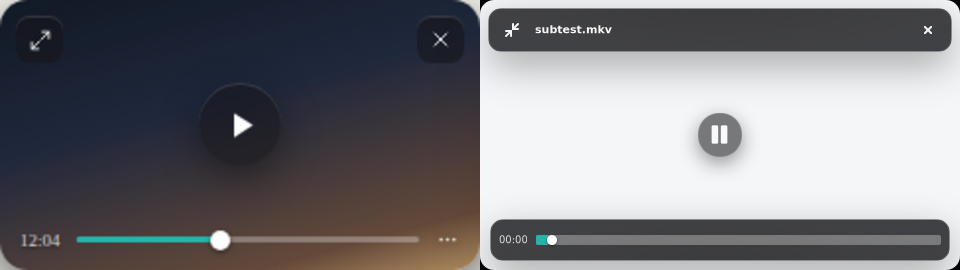
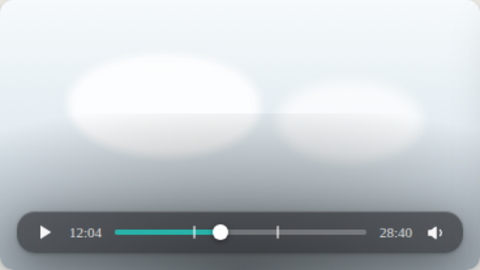
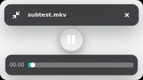
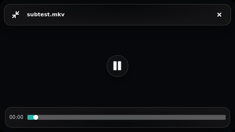

# Issue 192 — Linux compact mini-player evidence

The applicable art direction is the canonical Compact Modes handoff, especially
Band 01 (localized over-content material), Band 02 (compact transport), and
Band 03 (Mini-Player). The paired hover capture uses the same `480x270`
16:9 viewport and active-control state. The Linux implementation adds the
issue-mandated title between restore and close; the handoff mockup leaves that
space empty.

The separate material reference preserves the handoff's blown-out-snow acid
test used by the deterministic GTK capture.

## Exact redline accounting

| Area | Canonical contract | GTK result |
|---|---|---|
| Geometry | Real video aspect; shorter edge `270px` by default and `160px` minimum; `14px` radius; approximately `8px` resize zones | The 16:9 fixture enters at `480x270`, clamps at `284x160`, keeps `14px` rounded clipping, and expands the existing edge handles to `8px` in compact mode. Vertical and scope sizes use the same shared aspect calculation. |
| Spacing | Localized controls with `8-10px` edge insets and no full-height titlebar | Top cluster: `8px` outer inset, `6x8px` padding. Bottom cluster: `10px` side / `9px` bottom inset, `6x8px` padding. The `42px` center transport remains separated from both clusters at the `284x160` floor. |
| Type | Quiet, truncated now-playing title and tabular timecode | Title is `11px` semibold with end ellipsis; elapsed time is `10px` with tabular figures. The floor capture preserves the full fixture title without displacing close or restore. |
| Color/material | Theme-invariant `rgba(22,22,25,.56)` over-content fill, one light hairline, fixed `#28B3AA` seek accent, localized falloff, soft elevation | Both clusters use the specified 56% dark fill, 14% white hairline, fixed over-video teal rail, localized radial backing, and one shadow step. High-contrast and explicit reduce-transparency paths become solid with a visible border. |
| Iconography | Restore, close, and play/pause in the shipped compact family | Linux uses the platform-native symbolic equivalents at `16px`, with `28x28` restore/close targets and a `42x42` center play/pause target. Focus, hover, pressed, selected playback, and destructive-close treatments are explicit. |
| Control states | Idle hidden while playing; hover reveal; paused stays visible; loading/error remain non-modal | Compact controls join the existing 2.5-second chrome lifecycle. Paused playback pins them; the existing loading/error overlays remain in-canvas and the compact close/restore controls stay available. |
| Behavior | Same playback surface; restore is reversible; fullscreen is mutually exclusive; body drag, corner snap, and wheel volume remain available | Compact mode never creates or reloads mpv. Restore returns the saved normal size/maximize/always-on-top preference and current playback. Escape, double-click, restore, fullscreen, and media close all leave compact mode predictably. Body drag starts only after a `6px` threshold; X11 release within `48px` settles to a `16px` corner inset; wheel volume uses the existing stepped OSD path. |

## Deterministic evidence

`scripts/smoke-linux-compact-mode.sh` verifies:

- `480x270` entry from a mapped `1120x680` player;
- `_NET_WM_STATE_ABOVE` on X11;
- body drag and custom upper-left corner settle at exactly `16,16`;
- visible title/transport material over the bright-frame proof;
- the same fixed over-video material over a near-black frame;
- the separately rendered `284x160` minimum floor without clipped controls;
- exact `1120x680` restore in the same process;
- compact-to-fullscreen transition at the `1280x900` Xvfb work area;
- compact entry/restore debug events and absence of CSS/parser/panic failures.

## Evidence boundary

Xvfb/XFWM proves deterministic X11 geometry, pixels, EWMH always-on-top,
pointer-driven move initiation, single-monitor corner settling, minimum-size
composition, action routing, and reversible restore. It does not prove GNOME
Wayland compositor placement, Wayland always-on-top (GTK exposes no portable
protocol for it), compositor shadow quality, fractional scaling, or
multi-monitor corner selection. Those remain operator QA boundaries before
release; the PR does not claim them from headless evidence.
