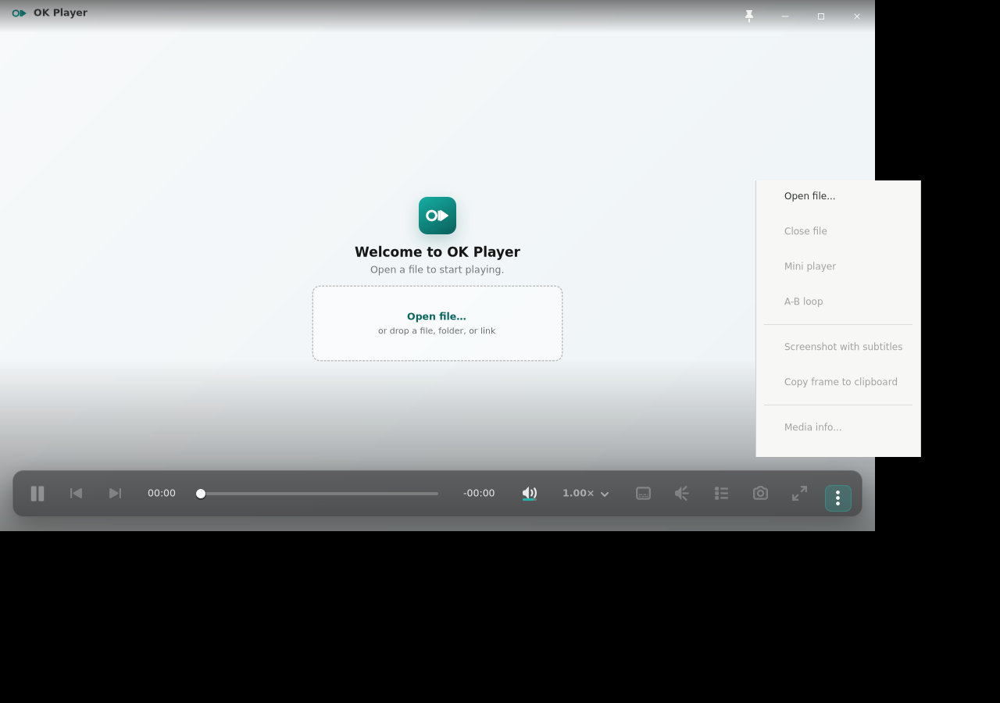
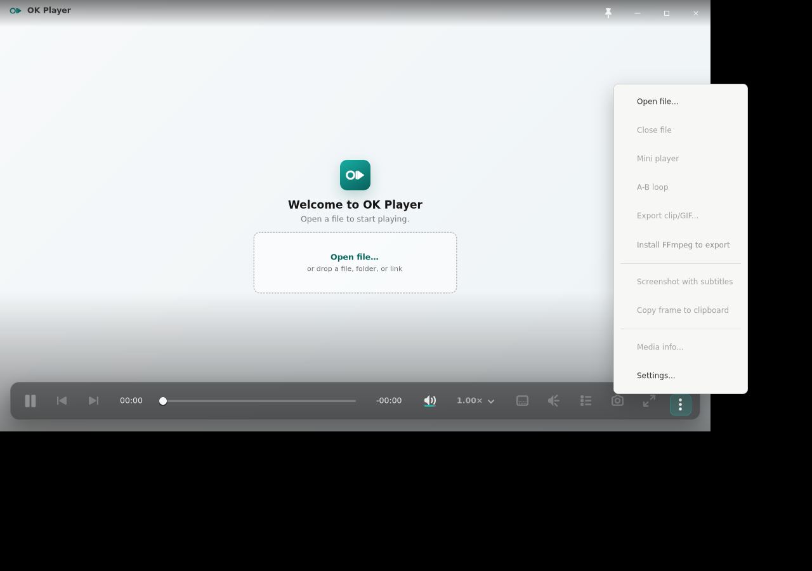

# Issue 228 A-B clip/GIF export placeholder

## Same-viewport reference and implementation captures

Reference More composition before the reserved export row:

Missing-tooling implementation state:

Selection-ready model state while the encoder remains deliberately unavailable:

All three native Linux captures use the fixed `1120 × 680` player viewport,
the same bright deterministic substrate, the same idle state, and the same More
anchor. `scripts/smoke-linux-clip-export.sh` opens the production popover after
its anchor maps and checks the state captures differ from the reference.

The issue names no separate clip-export mockup. The applicable art direction is
PRD P4-X6/P4-N5, the existing Windows player/seek-bar hierarchy, and the
established compact More-popover composition. The change therefore inserts the
reserved command immediately after A-B loop without introducing a dialog,
format controls, encoder progress, or a new visual pattern.

## Redline accounting

| Area | Reference / implementation accounting |
| --- | --- |
| Geometry | The More content width remains `210 px` (`212 px` including the native border). The reference visible height is `398 px`; the disabled command and reason extend it to `489 px` for missing tooling and `499 px` for the wrapped ready-state copy. The anchor and right alignment are unchanged. |
| Spacing | The new command uses the existing `31 px` command row, `2 px` vertical stack spacing, and the existing divider rhythm. It sits directly after A-B loop so selection and export remain one local group. |
| Type | The command and reason inherit the existing popover row and muted helper-label typography; no new font size, weight, or family is introduced. |
| Color / material | The native light popover surface, border, shadow, disabled foreground, and muted reason color are unchanged. No new color token or hardcoded accent is added. |
| Iconography | No icon is added. This preserves the current text-command grammar and avoids inventing a clip/GIF glyph outside the established icon set. |
| Control states | No A/B, invalid order, under/over duration, missing FFmpeg, and selection-ready states have distinct copy. The row remains disabled because issue #228 reserves the UX/model boundary but does not ship encoding. |
| Behavior | A/B loop and screenshot handlers are untouched. Runtime tooling discovery is a PATH executable probe only; no FFmpeg process or blocking mpv property read occurs when the popover opens. The core model can form a future clip/GIF request only from a ready selection. |

## Evidence limits

Xvfb proves deterministic GTK composition, geometry, and state rendering. It
does not prove a real encoder invocation, output chooser, portal, clipboard,
compositor, or live GNOME/Wayland focus behavior. Those flows are intentionally
outside issue #228 because no encoder or export dialog is implemented.
