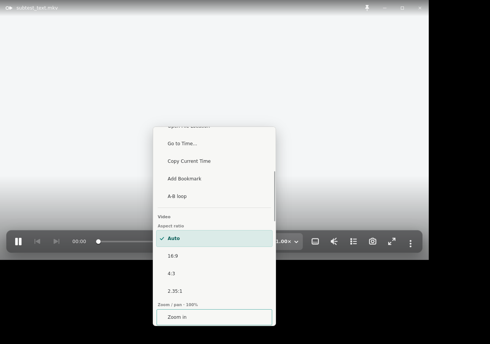
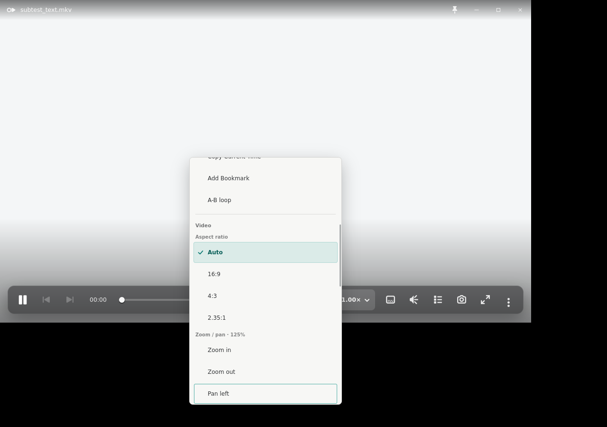
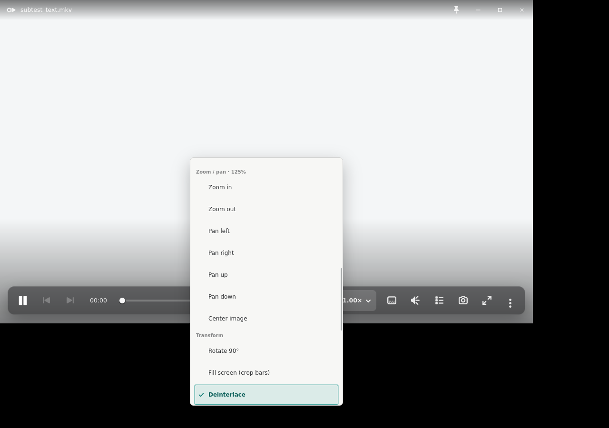
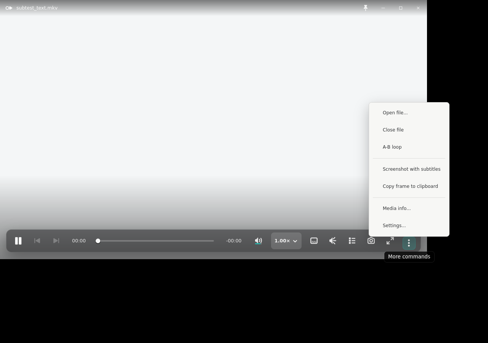

# Issue 231 — rarely-used video geometry acceptance

The canonical path is the player-wide right-click **Advanced commands** popover. The primary OSC
and its `210px` More popover remain curated and contain no geometry commands. All captures use the
same `1280×900` canvas as the canonical context-menu component reference from issue 290; the GTK
player remains `1120×680`.

## Reference and implementation states

- [Canonical context-menu component](../issue-290/reference-context-menu-1280x900.png) — the
  compact-modes context-menu extract used for row rhythm, material, checked state, and hierarchy.
- `geometry-zoom-in-focus-1280x900.png` — the Video group at its default 100% state: Auto is
  selected, Zoom in is keyboard-focused, and inapplicable zoom-out/pan actions are disabled.
- `geometry-pan-left-focus-1280x900.png` — after the real Zoom in command: the group reports 125%,
  Zoom out and pan become available, and Pan left is keyboard-focused.
- `geometry-deinterlace-selected-1280x900.png` — after the real deinterlace command: the toggle is
  selected and keyboard-focused below the zoom/pan and transform hierarchy.
- `primary-more-curated-1280x900.png` — the unchanged primary More popover, proving geometry did not
  move onto the OSC path.

The current Windows `PlayerView.xaml` remains the command-hierarchy reference: Video is a nested
context-menu group with Aspect ratio, Rotate, Fill screen, and Reset. Linux extends that tucked-away
group with the PRD-required zoom/pan and deinterlace paths without changing the primary transport.

## Redline accounting

| Area | Canonical accounting | GTK result |
|---|---|---|
| Geometry | Context menu at the pointer; compact elevated surface; advanced content may scroll | Existing `320px` advanced width and `520px` scroll cap are unchanged. Keyboard focus scrolls the Video group into view without widening or moving the primary OSC. |
| Spacing | Comfortable native row rhythm, quiet nested headings, grouped commands | Existing 2px content rhythm and native row padding are reused. `Video` contains three levels only: group heading, `Aspect ratio` / `Zoom / pan · N%` / `Transform` subheadings, then actions. |
| Type | Semibold hierarchy labels and ordinary command labels | Existing advanced-popover type styles are reused. The dynamic zoom percentage stays in the quiet subgroup label rather than adding a new badge or value column. |
| Color/material | Light elevated popover with one border, soft shadow, and restrained accent | Existing `okp-track-popover` material is unchanged. Teal appears only for selection/focus; disabled actions use the established muted state. |
| Iconography | Do not invent a new icon family for a text command tree | No icons were added. Aspect and toggles use the established checkmark state; other geometry commands remain native text rows. |
| Control states | Selected, focused, disabled-at-limit, and enabled-after-prerequisite states must be explicit | Auto and Deinterlace show checks. Zoom out and pan are disabled at 100%; zooming to 125% enables them. Directional pan disables at its bound, Center enables only after a pan, and Reset enables only for a non-default geometry state. |
| Behavior | Geometry is functional, tucked away, per-file for local media, and absent from the primary OSC | The smoke activates Zoom in, Pan left, and Deinterlace through keyboard traversal and observes the real libmpv command path. The resulting local-file preference is written to shared `history.json` as `video_geometry`; streams and private sessions do not write it. |

## Verification and evidence boundary

```bash
OKP_CONTEXT_SMOKE_SKIP_DRAG=1 ./scripts/smoke-linux-context-menu.sh \
  ./rust/target/debug/okp-linux-gtk ./artifacts/manual-ui/issue-231-context-menu

cd rust
CC=/usr/bin/cc cargo fmt --all -- --check
CC=/usr/bin/cc cargo clippy --workspace --all-targets -- -D warnings
CC=/usr/bin/cc cargo test --workspace
```

The issue-specific capture run skipped the independent title-drag probe; issue 290 already owns
that routing evidence and this diff does not touch drag handling. Xvfb/XFWM proves deterministic X11
composition, scrolling, keyboard traversal, selected/disabled states, and the tested libmpv command
path. It does not prove live GNOME/Wayland compositor placement, fractional scaling, multi-monitor
workareas, or desktop focus quality; those remain operator QA boundaries.








