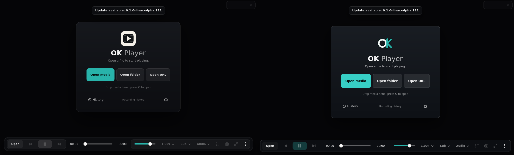
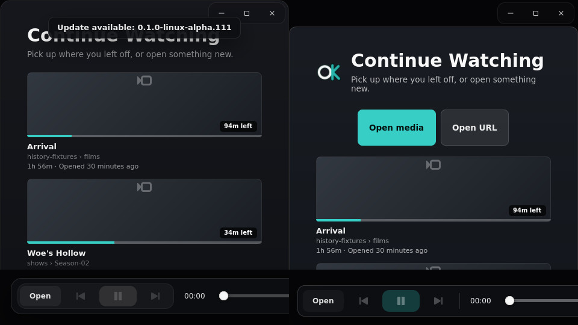
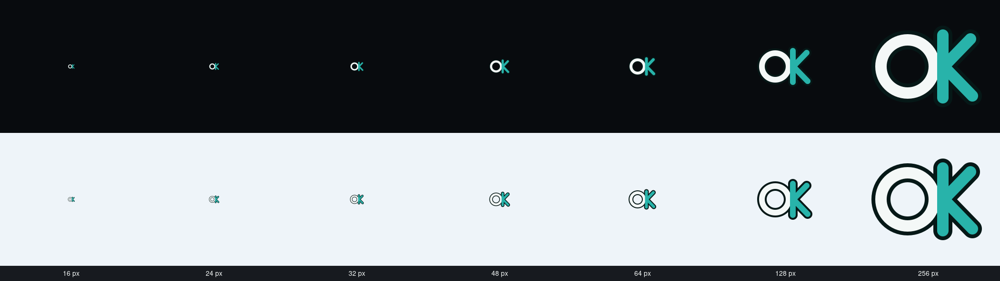
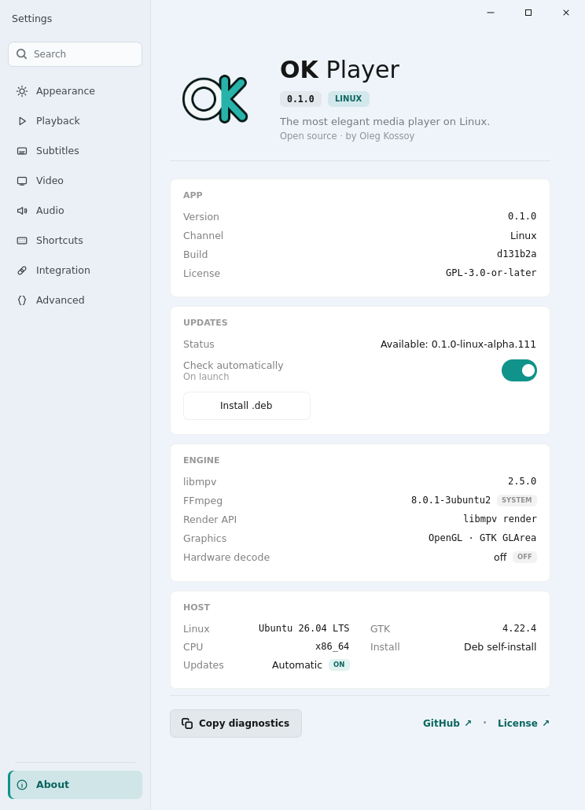

# Linux visual recovery evidence

Issue #240 visual evidence. In each comparison, the previous Linux alpha is on the left and the updated shell is on the right.

## Default window (1120x680)

## Narrow window (480x540)

## Shared identity

The source SVG is rendered at 16, 24, 32, 48, 64, 128, and 256 pixels on dark and light surfaces. The mark has no baked tile or play-button glyph.

The same vector asset is used by the desktop metadata, welcome and recents surfaces, MPRIS fallback art, and About.

