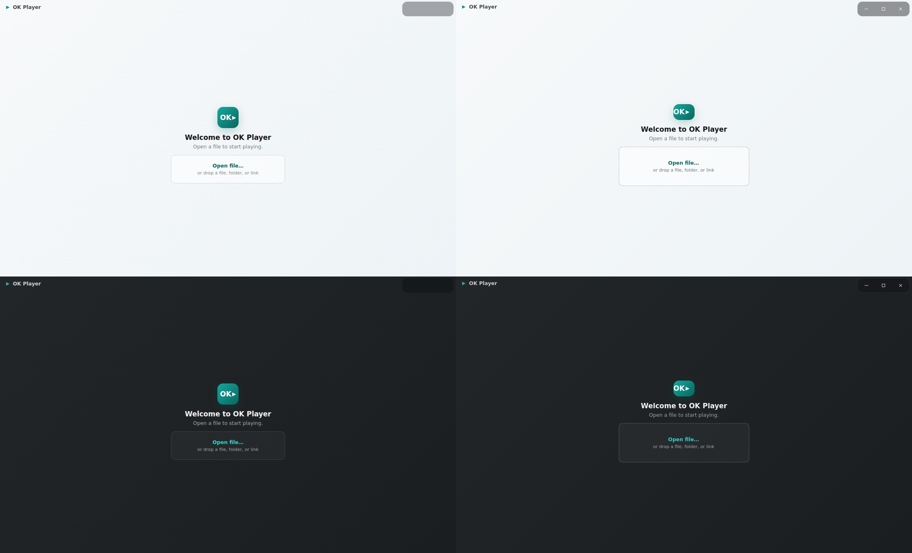
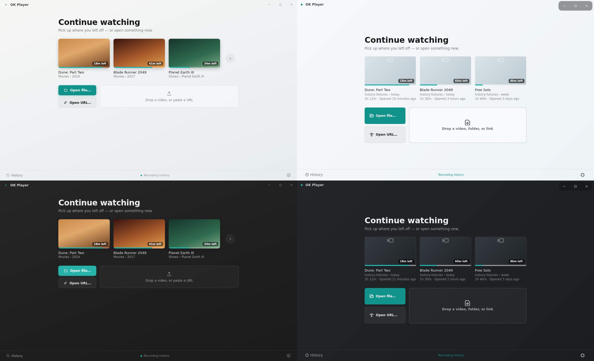
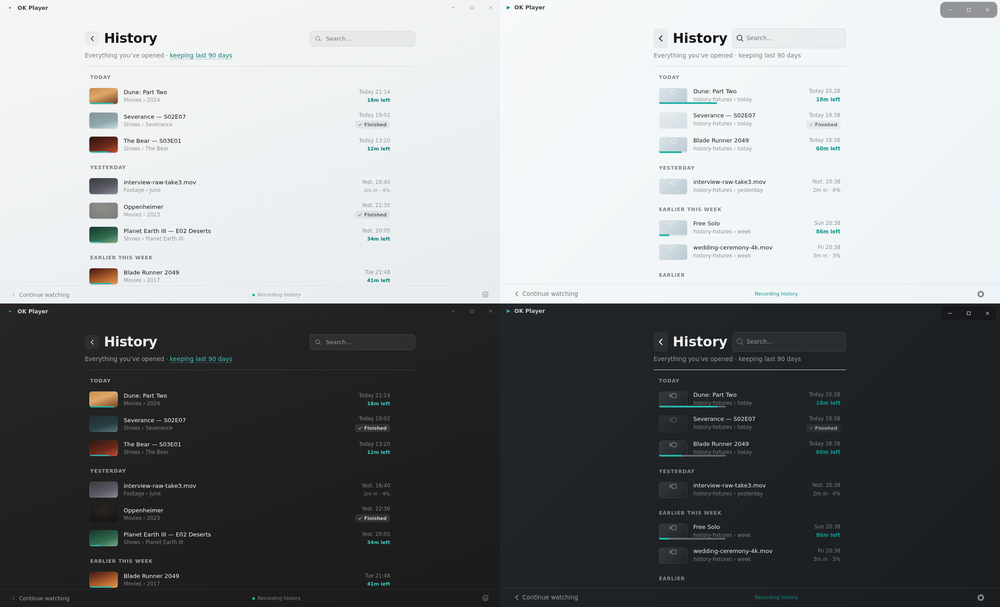
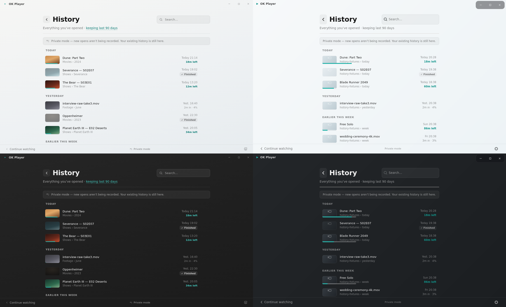
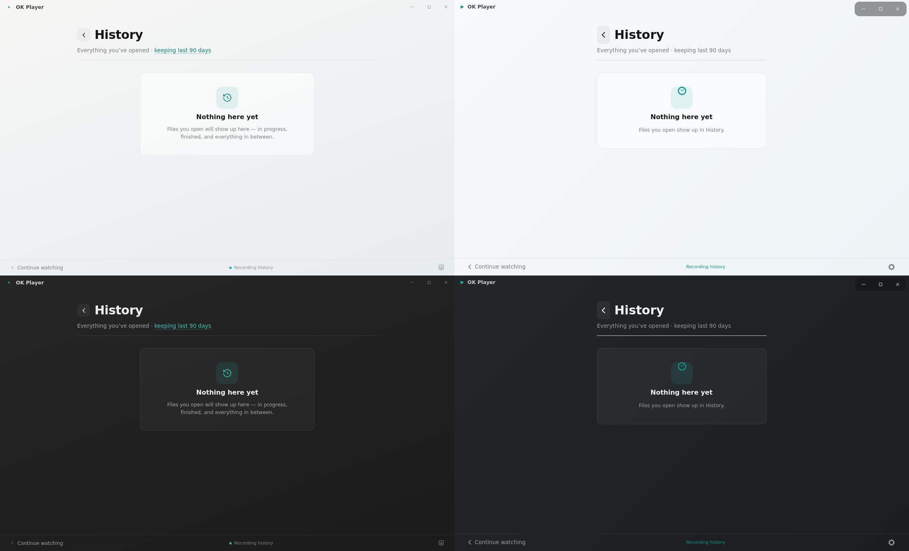
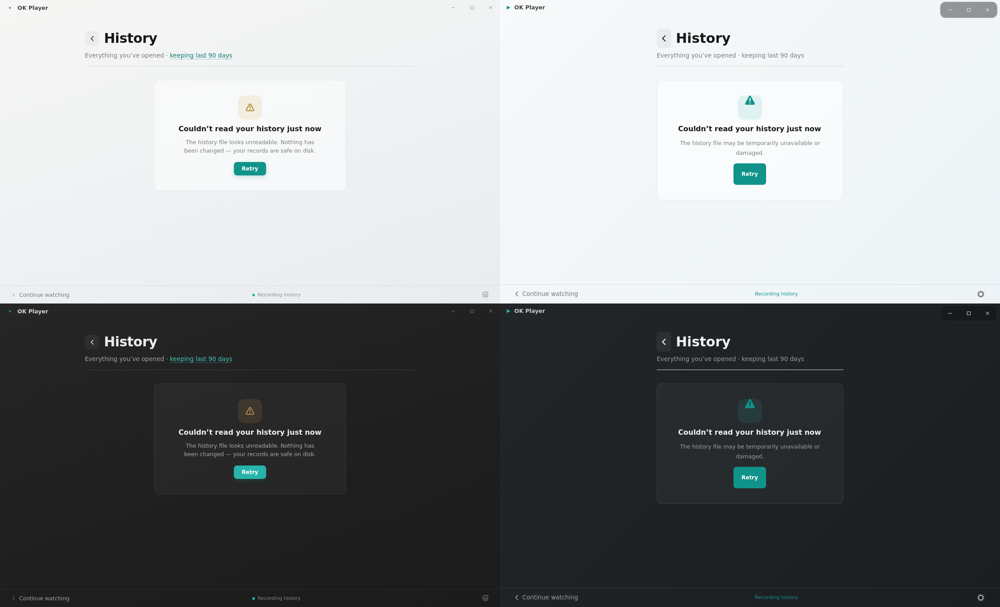
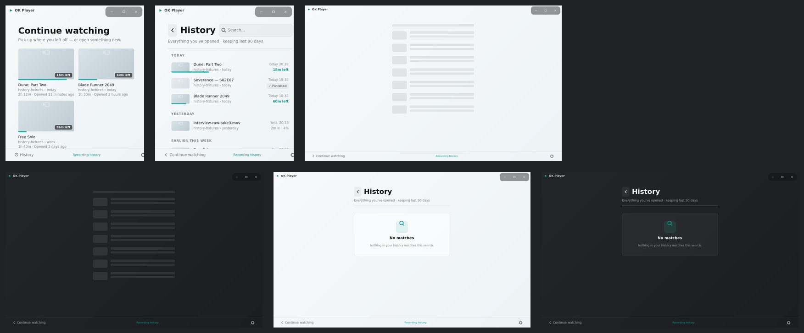

# Issue 249 visual accounting

Each comparison is a 2x2 grid of unscaled `1120x680` captures:

- top-left: canonical reference, Light
- top-right: GTK implementation, Light
- bottom-left: canonical reference, Auto-dark
- bottom-right: GTK implementation, Auto-dark

The Continue Watching and History references are rendered from the canonical History design artifact. The first-run reference is rendered directly from the shipped Windows `PlayerView.xaml` geometry because that state is not present in the History prototype.

## Required captures

### First run

### Continue Watching

### History with data

### History in private mode

### History empty

### History error

The extra matrix shows, left-to-right: narrow Continue Watching, narrow History, Light loading; then Auto-dark loading, Light no-match, and Auto-dark no-match.

## Redline

| Area | Canonical value | GTK accounting |
|---|---:|---|
| Window | `1120x680` | Exact in every required capture. |
| Idle substrate | Full-window themed/Mica-like canvas | Full-window neutral Light and Auto-dark canvas; no video-black panel and no modal welcome card. |
| First-run brand | `52x52`, radius `14`, teal gradient, white `OK▶` | Exact geometry and identity family. |
| First-run type | title `17px` semibold; concise secondary copy | Exact sizes and hierarchy. |
| First-run target | about `280px`, dashed, single Open/drop action | `280px` minimum width, `70px` height, dashed `1.5px`; no folder or URL co-primary button. |
| Continue column | centered, maximum `920px`, outer padding `44x36` | Centered natural-width column inside the `920px` ceiling; exact `44x36` padding. |
| Continue heading | `30px` semibold; subtitle `13.5px`; shelf gap `22px` | Exact. |
| Recent cards | `194x110`, gap `14`, radius `8`, progress `4px` | Exact. Remaining badge uses the canonical compact `10px` treatment. |
| Actions | two-action column plus large dashed drop zone | Exact hierarchy: Open file, Open URL, then drop zone. Folder remains accepted by drop/open routing without becoming a hero CTA. |
| Footer | quiet `42px`, History / recording state / Settings | Exact height and slots; first-run correctly omits the footer. |
| History placement | same idle canvas, same footer | Exact. No transient History window is created. |
| History grouping | TODAY / YESTERDAY / EARLIER THIS WEEK / EARLIER | Exact and core-derived. |
| History rows | `64x36` thumbnail; title/source/state/timestamp | Exact thumbnail geometry and state anatomy for in-progress, finished, and barely-started rows. |
| History states | loading, error, first/cleared empty, private, no-match | All implemented and smoke-captured in Light and Auto-dark. |
| Motion | welcome/History cross-fade around `180ms` | `GtkStack` cross-fade at `180ms`; `gtk-enable-animations=false` or `OKP_REDUCED_MOTION` switches instantly. |
| Idle chrome | no OSC or duplicate Open action | Transport revealer is hard-gated by media availability; titlebar controls remain available. |
| Identity family | launcher/welcome tile; tiny play mark; separate About illustration | Restored as three distinct assets/treatments. |

## Remaining pixel deltas

- GTK/Pango font rasterization and native symbolic icon strokes differ slightly from WinUI/browser reference rendering while preserving the specified sizes, weights, and hierarchy.
- Smoke fixtures intentionally use neutral thumbnail placeholders instead of copyrighted poster frames; thumbnail, progress, badge, and row geometry remain exact.
- Linux keeps its existing grouped caption-control material. The reference uses Windows caption buttons; titlebar parity is tracked separately and does not alter the idle/history composition.
- The Linux drop copy says “video, folder, or link” to expose the already-supported folder route. The canonical hierarchy remains unchanged and no folder CTA is added.

## Verification limits

These Xvfb captures prove deterministic rendering, geometry, themes, state selection, and single-window History composition. They do not prove a live desktop file chooser, portal integration, compositor material, drag/drop delivery, focus behavior, or clipboard interaction; those require operator QA on a real GNOME session.
