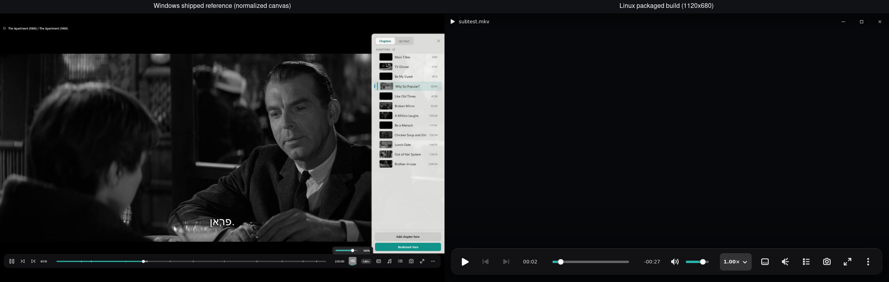
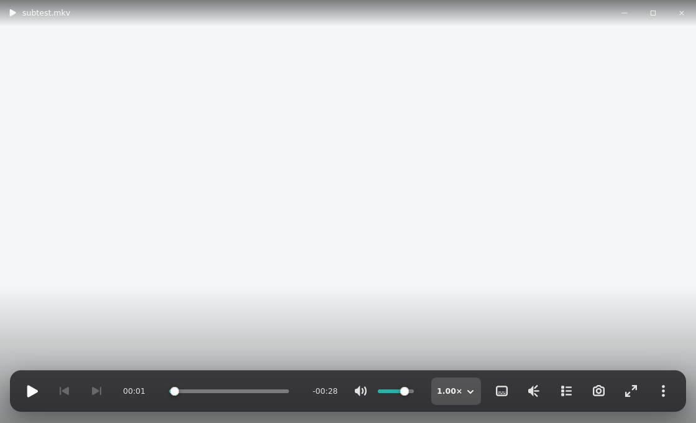
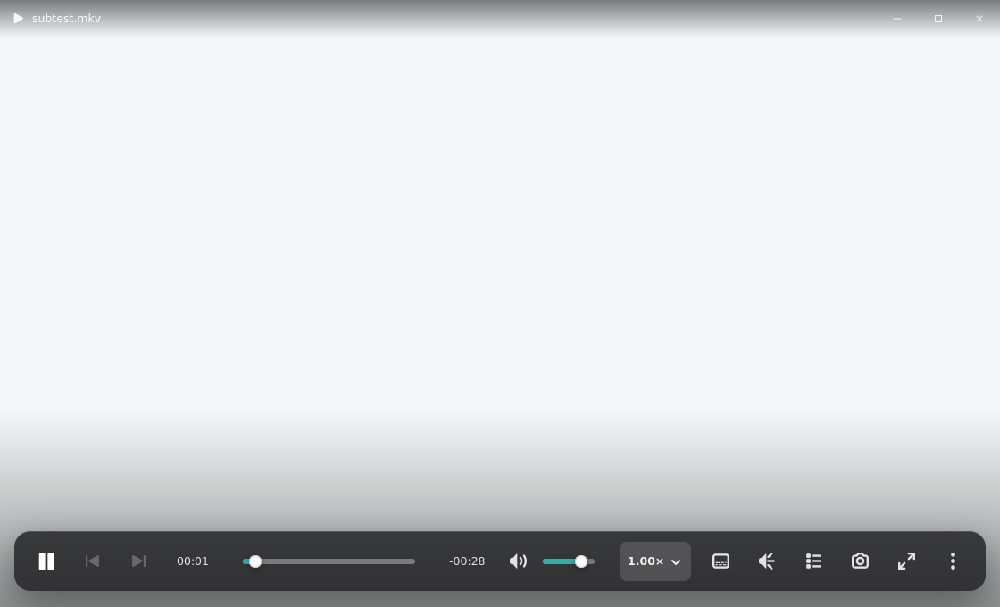
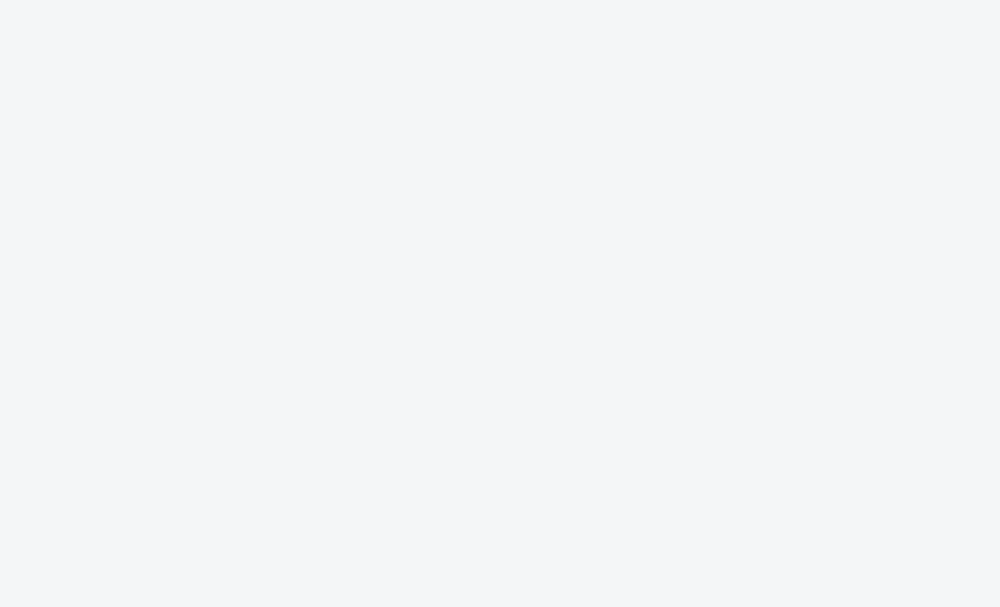
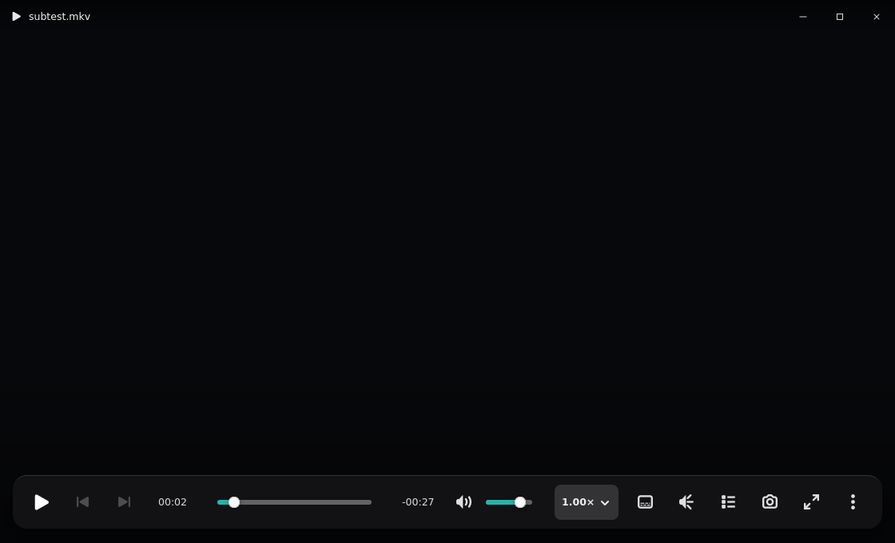

# Linux canonical playback chrome evidence

Issue #250 playback evidence captured from the Debian package binary. The Linux
window captures are native 1120x680. The shipped Windows reference source is
1280x720; `windows-reference-1120x680.png` proportionally fits that unmodified
capture onto an 1120x680 canvas so the full reference remains visible. Geometry
accounting below uses the shipped XAML values, not measurements from the scaled
reference image.

## Reference comparison



The Windows source capture includes its Chapters panel. That panel is outside
issue #250; the comparison accounts for the shared titlebar and OSC only.

## Redline accounting

| Role | Canonical | Linux implementation |
|---|---:|---:|
| Playback canvas | Edge-to-edge | Edge-to-edge `GtkGLArea`; overlays do not resize it |
| Titlebar | 42px | 42px |
| Caption targets | 46x42px | 46x42px, transparent resting surface, no capsule |
| Title inset | 14px | 14px with 13px media glyph and 12.5px title |
| Top motion | 180ms, -10px | 180ms opacity and -10px translate |
| OSC inset | 16px sides, 18px bottom | 16px sides, 18px bottom |
| OSC interior | Compact playback family | 14x7px padding, 14px radius, 16px gaps (updated by #265) |
| Targets | Compact primary targets | 32x32px (updated by #265) |
| Glyphs | Play 22px; prev/next 17px; utility 19px | Exact optical sizes via symbolic icons |
| Time | 12.5px, tabular, 54/62px | Exact values; trailing readout is remaining time |
| Timeline | 4px rail, 12px thumb, at least 20px hit area | 4px rail, 12px thumb, 20px minimum height |
| Material | Locked over-video material | `rgba(22,22,25,.50)` plus localized scrim and 12% hairline (#265 GTK blur fallback) |
| Depth | Soft overlay shadow, 220px bottom scrim | 0 14 40 / 40% shadow, 220px scrim |
| Accent | Fixed `#28B3AA` over video | Fixed `#28B3AA` seek/volume fill |
| Hide motion | 180ms opacity, 200ms +16px | Exact values |
| Idle timeout | About 2.5s while playing | 2500ms; paused/panel/popover pins chrome |

Control order is Play/Pause, Previous Chapter, Next Chapter, elapsed, expanding
timeline, remaining, volume, `1.00×`, Subtitle, Audio, Chapters, Screenshot,
Fullscreen, overflow. Open remains available through keyboard, context/overflow,
and empty-state actions; it is not duplicated in the OSC. The former toolbar
separators and grouped islands are removed.

GTK uses platform symbolic icons instead of copying Segoe Fluent glyphs. The
roles, optical sizes, target geometry, state colors, focus rings, disabled
states, and tooltips match the canonical control contract.

## Captured states

### Loaded and paused, bright frame



### Playing with OSC



### Playing idle, zero chrome



### Loaded and paused, dark frame



### Fullscreen idle


The bright/dark planes are deterministic presentation fixtures layered below
real loaded-media chrome because Xvfb cannot reliably capture the libmpv GL
frame on every renderer. The real-libmpv fullscreen smoke separately drives
playback, pause, fullscreen, and the idle timer.

## Verification

```bash
cd rust
CC=/usr/bin/cc cargo fmt --all -- --check
CC=/usr/bin/cc cargo clippy --workspace --all-targets -- -D warnings
CC=/usr/bin/cc cargo test --workspace
```

Visual coverage:

```bash
./scripts/smoke-linux-main-window.sh /path/to/ok-player
./scripts/smoke-linux-playback-chrome.sh /path/to/ok-player
./scripts/smoke-linux-fullscreen-chrome.sh /path/to/ok-player
./scripts/smoke-linux-empty-states.sh /path/to/ok-player
./scripts/smoke-linux-side-panel.sh /path/to/ok-player
```

## Operator QA

Real GNOME/Wayland QA remains required before release. Xvfb does not prove
compositor presentation, pointer hiding, caption-button hit testing, keyboard
focus traversal, popover focus, portal/file chooser behavior, or smooth subtitle
movement over a decoded frame. Operator QA should exercise all of those on the
packaged build at 1120x680 and fullscreen.
