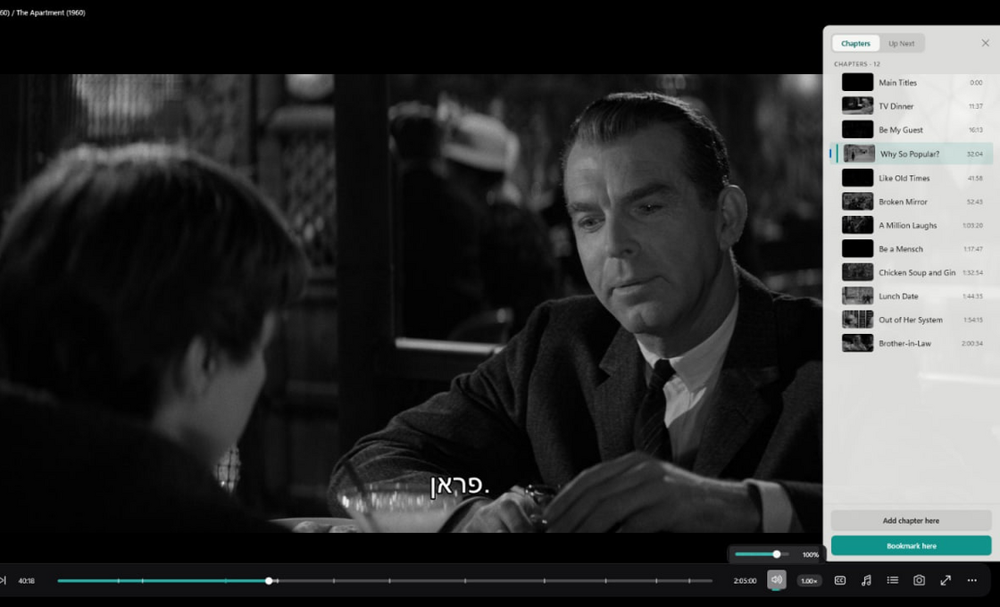

# Linux Chapters and Up Next visual acceptance

Issue #251 evidence at the required 1120x680 viewport. The shipped Windows player capture is normalized from 1280x720 by preserving its height and cropping from the left, so the canonical right-edge panel remains intact.

## Reference

## Implementation states

| State | Capture |
|---|---|
| Chapters populated, current chapter | [GTK Chapters](gtk-chapters-populated-1120x680.png) |
| Bookmarks populated | [GTK Bookmarks](gtk-bookmarks-1120x680.png) |
| Up Next populated | [GTK Up Next](gtk-up-next-populated-1120x680.png) |
| Chapters empty | [GTK Chapters empty](gtk-chapters-empty-1120x680.png) |
| Up Next single-item queue | [GTK Up Next empty](gtk-up-next-empty-1120x680.png) |
| Bright-video legibility | [GTK Chapters bright substrate](gtk-chapters-bright-1120x680.png) |

## Exact redline

| Area | Contract and implementation |
|---|---|
| Viewport | 1120x680 |
| Panel bounds | `x=804`, `y=44`, `width=316`, `height=556`; flush right, `80px` bottom inset |
| Shape | `12px 0 0 12px` corner radii; 1px top/left/bottom hairline |
| Motion | Full-width `316px` slide from the right plus crossfade, `250ms`; GTK animations-off disables the built-in revealer transitions |
| Header | `14/8/6/14px` padding; segmented container `3px` padding, `8px` radius; tabs `28px` minimum height, `16px` horizontal padding, `6px` radius |
| Chapter row | `5px` vertical padding; current rail `3x34px`; thumbnail `56x32px`, `4px` radius; title `13px`; time `11px` tabular figures |
| List insets | `8px` left/right; section labels `11px` semibold; row radius `6px` |
| Material | `rgba(244,244,244,0.96)` panel, restrained hairline and left-cast shadow; legible over the captured dark and bright substrates |
| Active states | White selected segment with teal text; current chapter teal inset rail and tint; queue current tint, watched dimming, `NOW` and `NEXT` distinctions |
| Empty states | Chapters includes the PRD message and teal bookmark action; Up Next keeps the now-playing item and Add files action |
| Behavior | Panel overlays the video plane without resizing it, pins chrome while open, and keeps chapter jump, bookmark add/remove/jump, queue jump/reorder/play-next/remove, and Add files actions |

## Verification scope

The captures are deterministic Xvfb/X11 render evidence. They do not prove compositor integration, installed GNOME/Wayland behavior, portal dialogs, focus across a real desktop session, or drag-and-drop between desktop applications. Installed GNOME/Wayland operator QA remains required before release.
