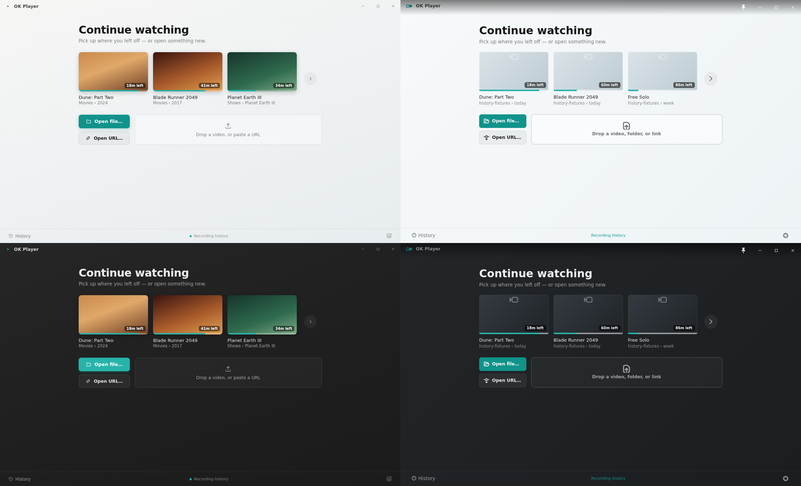
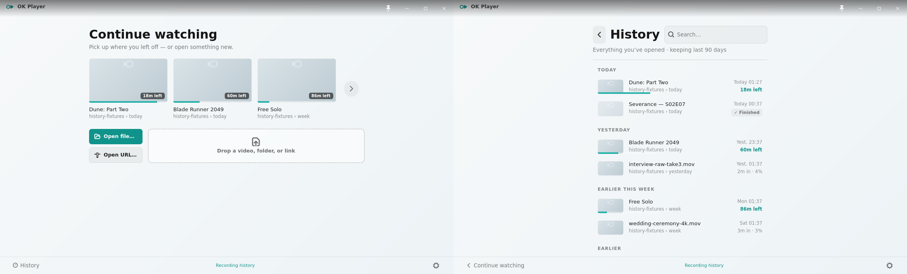
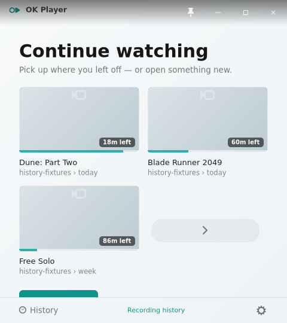
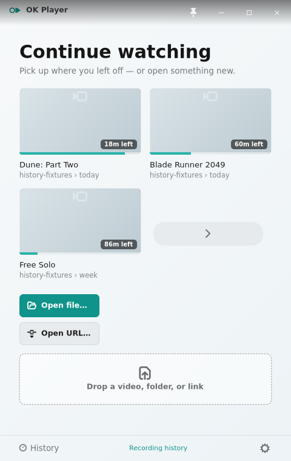

# Issue 260 visual accounting

The Continue Watching comparison is a 2x2 grid of unscaled `1120x680` captures:

- top-left: canonical History artifact, Light
- top-right: GTK implementation, Light
- bottom-left: canonical History artifact, Auto-dark
- bottom-right: GTK implementation, Auto-dark

The transition evidence shows the same GTK window immediately before and after clicking the trailing recents arrow.

The narrow captures are unscaled at the same `480px` width: `480x540` shows the initial shelf
hierarchy, while `480x760` shows both complete action children above the fixed footer.

## Redline

| Area | Canonical value | GTK measurement/accounting |
|---|---:|---|
| Window | `1120x680` | Exact in Light and Auto-dark. |
| Wrapper | centered `744px`; `32px` horizontal padding | Outer `x=188`; heading/card content begins at `x=219..222` after native antialiasing. Inner width is `680px`. |
| Vertical placement | heading visible top `y=74 +/- 2` | `y=73` in both themes. The has-recents composition is top-aligned; first-run and private states remain centered. |
| Cards | three `194x110` cards; `14px` gaps; top about `y=146` | Card starts are `x=220/428/636`; flat top is `y=146` (`y=144..145` is the first rounded-corner edge pixel). |
| Arrow | trailing `48px` column | Column begins at `x=844`; native `36px` circular button is centered at `x=868`, `y=220`. The remaining `8px` completes the `680px` inner width. |
| Actions | column about `132px`; `14px` gap; drop target about `534px`; row about `84px` high; top about `y=320` | Light measures `132/534/84px`; Auto-dark measures `132/533/83px` from antialiased rendered bounds. Both start at action `x=220`, drop `x=366`, with the first rounded edge at `y=318..319`. |
| Footer | unchanged `42px` footer | Footer allocation and divider remain unchanged from issue 249; no footer composition or CSS was modified. |
| Type | heading `30px` semibold; subtitle `13.5px`; card title `13px`; source `11.5px` | Sizes, weights, hierarchy, and zero letter spacing remain pinned. GTK/Pango rasterization differs from the browser reference. |
| Color/material | neutral Light and Auto-dark canvas; teal progress/accent | Existing themed substrate, card placeholders, progress bars, buttons, drop target, and footer tokens are unchanged. |
| Iconography | compact right chevron in a circular subtle control | Native `go-next-symbolic`, `36px` control inside the `48px` column, with hover styling and a History tooltip. |
| Behavior | arrow opens History in the same canvas | X11 click changes the same `1120x680` window from Continue Watching to History (normalized before/after RMSE `0.109533`); no separate History toplevel appears. |
| Narrow width | whole-child reflow; no horizontal clipping or footer occlusion | At `480px` wide, cards reflow `2 + 1` and the arrow wraps beside the third card. The `480x760` accounting capture shows the complete action column and complete drop target above the unchanged `42px` footer. |
| Idle chrome | no OSC | The lower canvas stays calm; only the pinned footer remains. |

## Architecture

`okp-core::recents_shelf` retains only portable history selection, filtering, ordering, resumable-state, and runtime-label behavior. Fixed wrapper, card, gap, History-control, and action-row design tokens live in the GTK history view and stylesheet, with shell-local geometry tests. The responsive GTK action-row widget owns the wide `132 + 14 + 534` allocation and stacks whole children below the `680px` content breakpoint.

## Verification limits

The Xvfb captures prove deterministic GTK rendering, measured geometry, Light/Auto-dark parity, narrow whole-child reflow, pointer routing to the recents arrow, same-window History navigation, and absence of idle OSC chrome. They do not prove compositor material, live GNOME focus behavior, portal/file chooser behavior, drag/drop delivery, clipboard integration, or other real-desktop flows. Operator visual acceptance against the canonical artifact remains a separate release gate.
