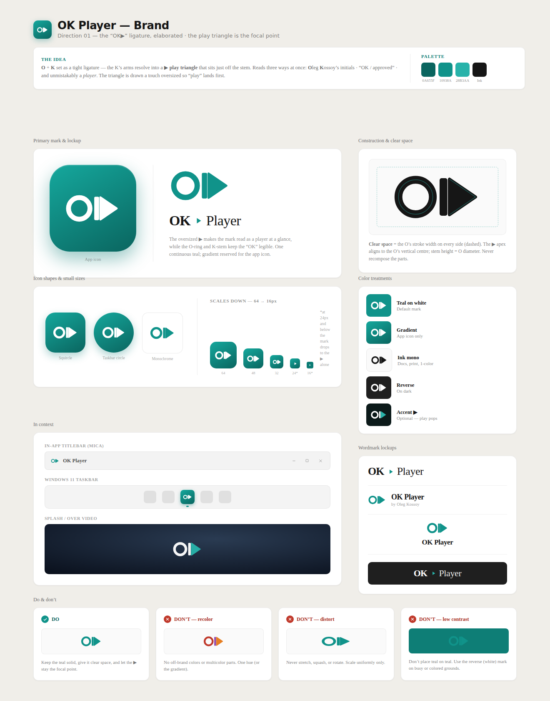
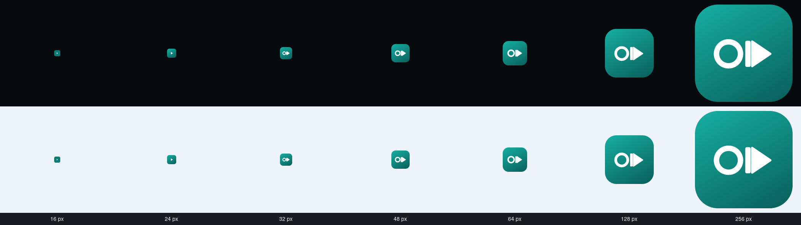
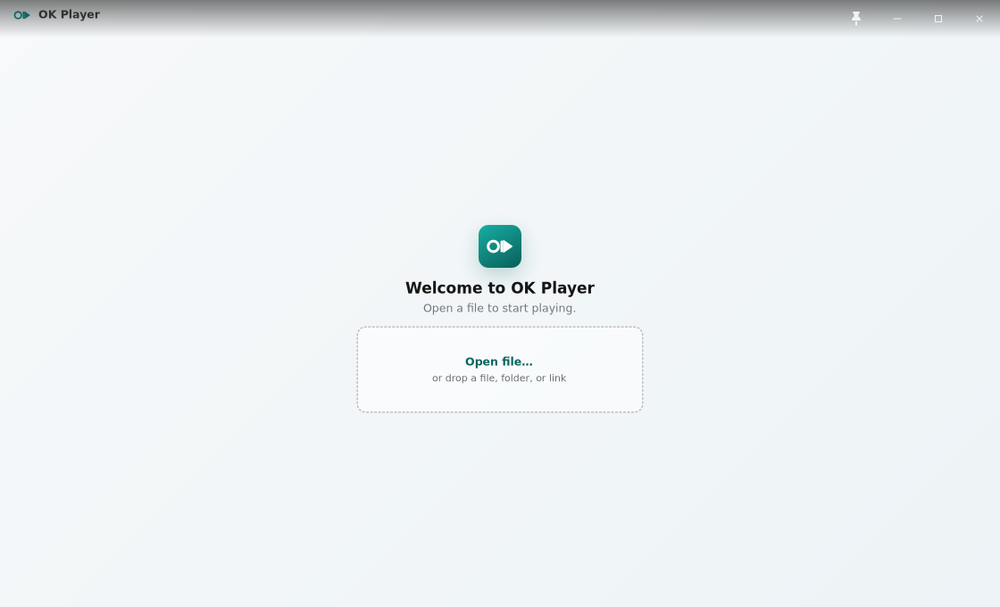
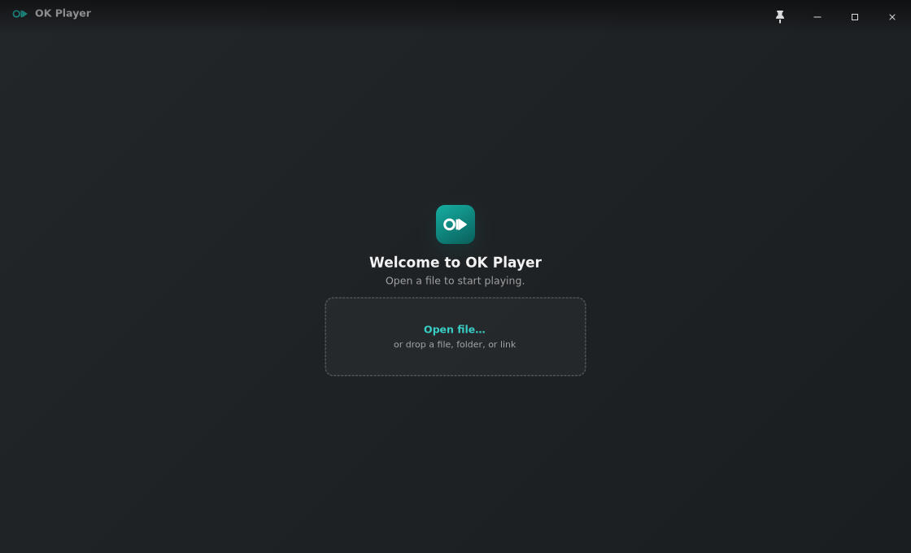

# Linux canonical vector identity evidence

Issue #261 visual evidence. The reference is the supplied `OK Player - Branding.dc.html` artifact rendered at `1320×1680`; implementation captures use the deterministic Xvfb/Cairo path.

## Authoritative reference

## Exact-size hierarchy

The package sources render the full ligature at `64`, `48`, and `32` px, the simplified play triangle at `24` and `16` px, and the canonical full geometry for larger scalable fallbacks. Each tile is shown on dark and light backgrounds.

## First-run identity

Both captures are `1120×680`. The welcome tile is `48×48`, with an `11px` corner radius, a `150deg` `#15A89D → #0A655F` gradient, and the white 48 px optical full-mark variant. The gradient and mark are rasterized together from the canonical Cairo vectors into one immutable GTK texture, so compositor redraws cannot separate the foreground geometry from the tile. The idle titlebar uses the explicit `20×11` full-mark exception from the Branding artifact.

## Redline accounting

| Area | Reference | Implementation |
|---|---|---|
| Geometry | `176×96`; O `(46,48) r33 / 15`; stem `92,12,15×72 r4`; triangle `111,14 → 111,82 → 161,48 / 6` | Shared `okp-core` constants drive Cairo; the scalable package SVG repeats the same explicit primitives. |
| Small sizes | Full optical variants at `64/48/32`; play-only at `24/16` | Fixed hicolor SVGs encode the same hierarchy and exact stroke/path adjustments. |
| Clear space | One O-stroke around the free-standing mark; icon examples center the mark at roughly two-thirds tile width | Launcher marks are centered at two-thirds tile width; the titlebar keeps the artifact's compact full-mark exception. |
| Color/material | App-icon-only gradient `#15A89D → #0A655F`; white reverse mark | Package and welcome tiles use the fixed gradient and white geometry; titlebar marks use fixed brand teal on idle surfaces and white over video. |
| Shape | `64/48/32/24/16` radii `15/11/8/6/4` | Fixed-size assets use those exact radii; scalable `128` uses `30`. |
| Typography | Mark geometry is never composed from type | Package SVGs contain no `<text>`; GTK uses `DrawingArea` primitives instead of `OK` or play-glyph labels. |
| About | Separate frame-ticks-to-triangle illustration | Unchanged and still covered by its existing geometry tests. |
| Behavior | Launcher/task switcher resolves the app identity; first run and titlebar use the specified variants | Both package lanes install the hicolor hierarchy, the GTK window advertises `com.befeast.okplayer`, and first-run/titlebar widgets use the correct variants. |

## Evidence limits

The Xvfb captures prove deterministic rendering, geometry, theme treatment, and nonblank output. The branding smoke drives GTK's real dark-preference property across light-to-dark and dark-to-light process sequences and requires near-white mark pixels, so a gradient-only tile cannot pass. The icon-cache smoke proves that a generated hicolor cache accepts every packaged size. These checks do not prove a live GNOME launcher, task switcher, Wayland compositor scaling, or post-install desktop cache refresh; operator acceptance on the packaged build remains required before the draft can be marked ready.
