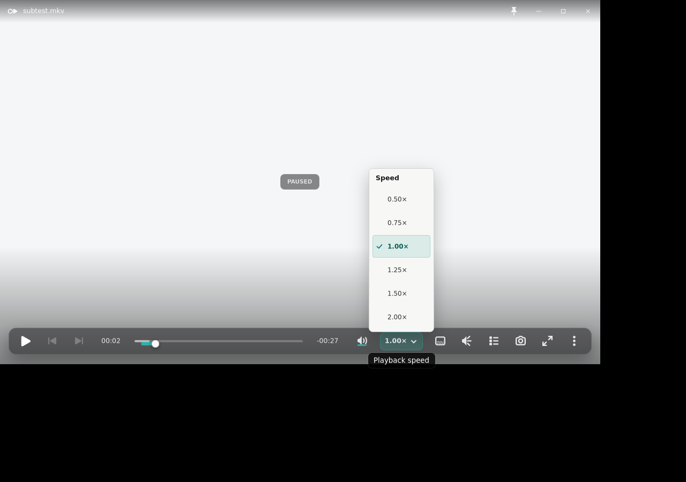
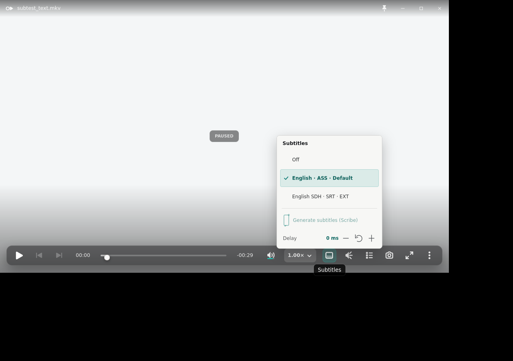
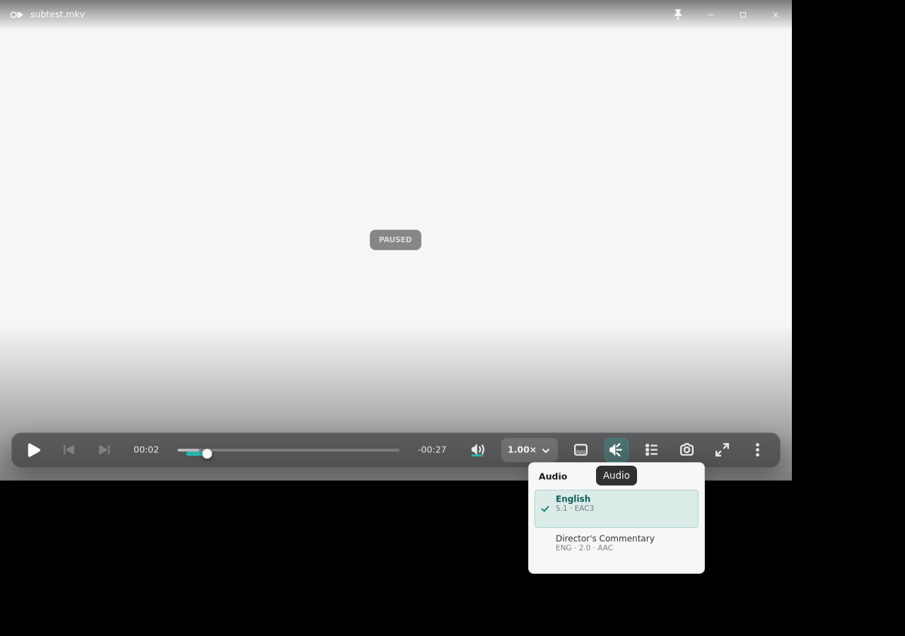
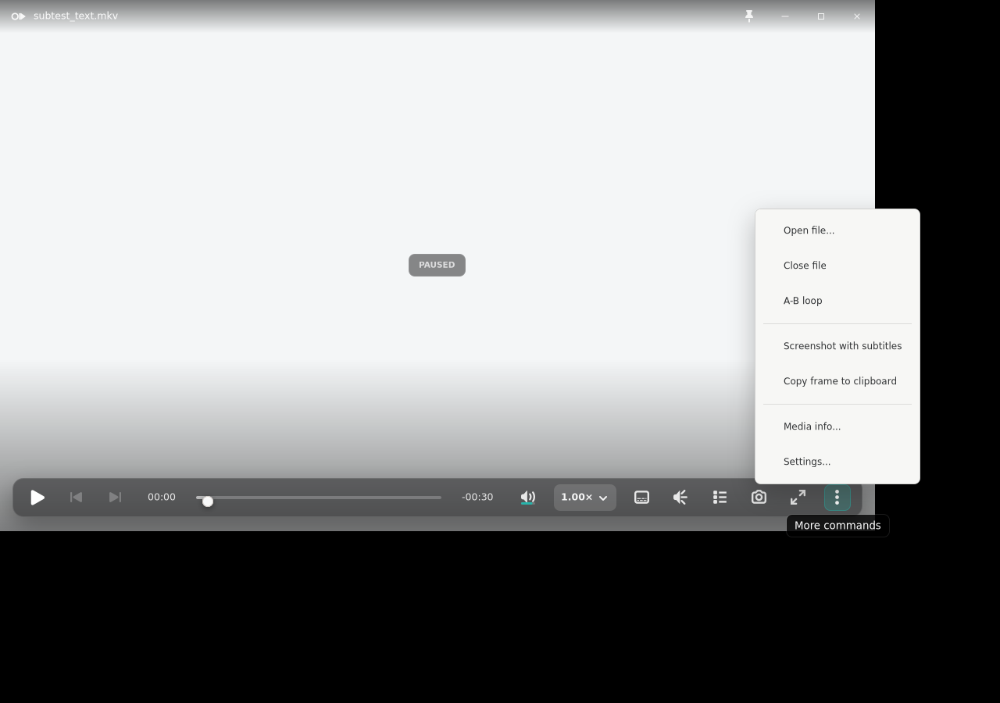
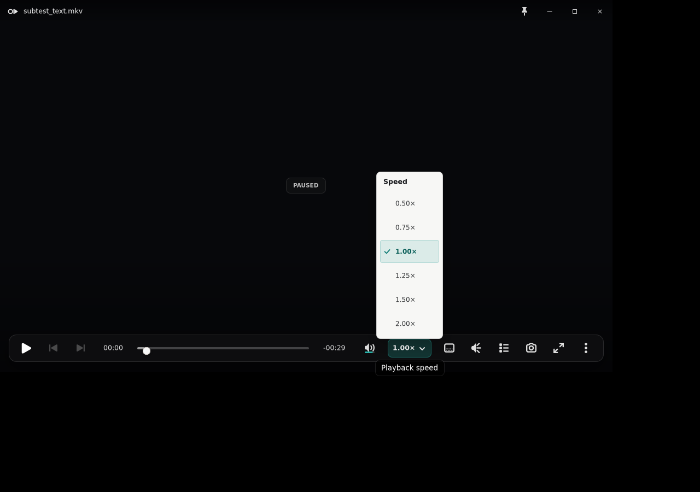
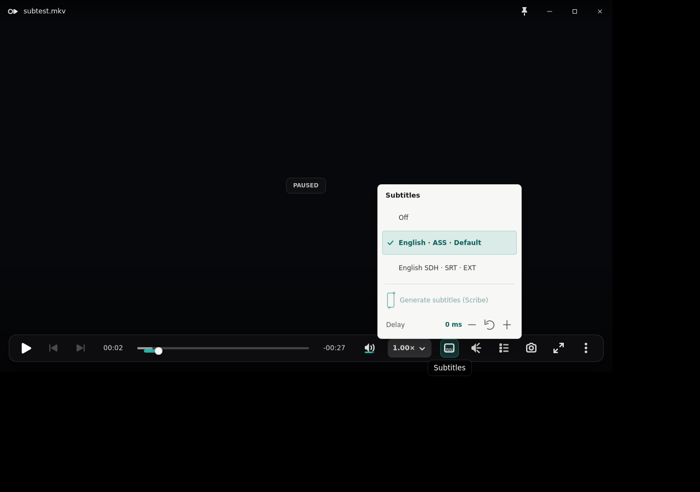
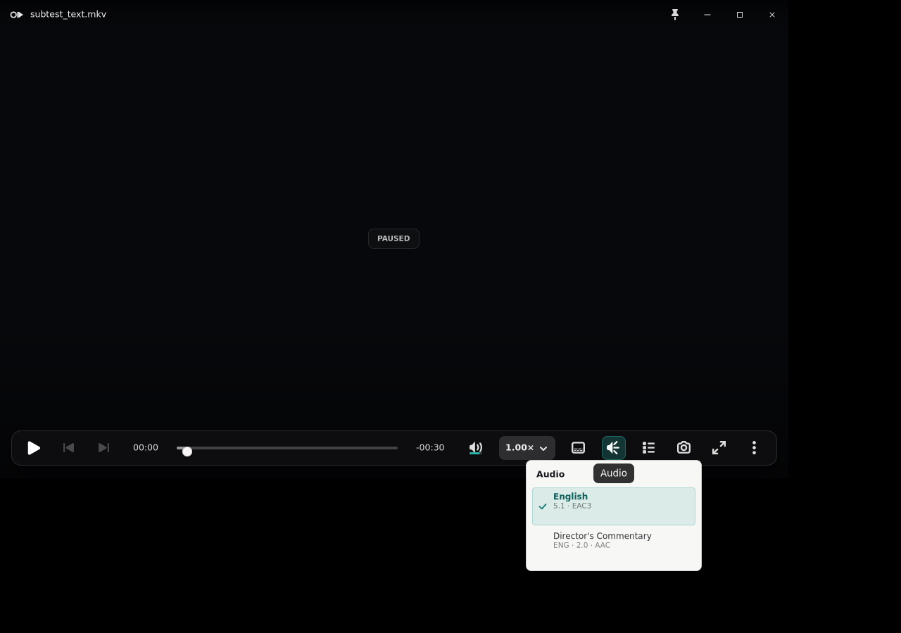
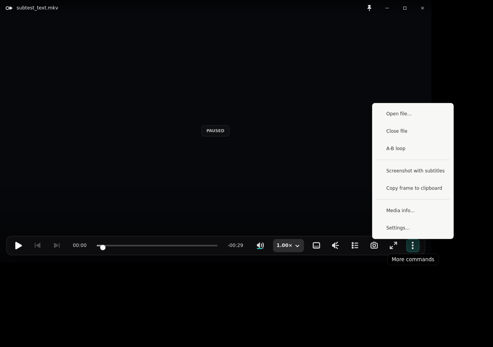

# Issue 264: canonical player popovers

The deterministic Xvfb captures exercise the four OSC popovers over both the
bright and dark playback substrates. The player remains at `1120x680`; root
captures are `1280x900` because GTK popovers are native popup surfaces and may
extend beyond the player window.

## Geometry

| Popover | Requested content width | Photographed surface |
|---|---:|---:|
| Speed | 120px | 122px including two 1px borders |
| Subtitles | 262px | 264px including two 1px borders |
| Audio | 248px | 250px including two 1px borders |
| More | 210px | 212px including two 1px borders |

Each popup is centered on its originating OSC control. The smoke rejects an
anchor-center delta above 3px and rejects any quick surface that falls back to
the advanced command tree's 320px width.

At the 1120x680 acceptance viewport, the integrated post-volume OSC target
centers are Speed 749px, Subtitles 822px, Audio 874px, and More 1072px. The
regenerated run measured popup-center deltas of 0px, 0px, 2px, and 0px.

## Content hierarchy

- Speed contains the six playback presets and a deterministic selected check.
- Subtitles contains Off/primary tracks, the reserved disabled Scribe action,
  and the compact delay stepper. Add-file, secondary-track, and size controls
  remain in Settings -> Subtitles.
- Audio contains only compact track rows, with the primary name above normalized
  language/channel/codec detail. Precise delay editing, output devices, and the
  Off escape remain in Settings -> Audio.
- More contains Open, Close, A-B loop, screenshot-with-subtitles,
  copy-to-clipboard, Media Info, and Settings in three groups.
- The complete legacy command tree remains the deliberate video right-click
  advanced escape hatch; no command implementation was removed. The focused
  smoke opens that 320px surface with a real button-3 click on the video plane.
- Subtitle-delay buttons project the exact applied value directly into the open
  quick row and Settings label. Rapid clicks accumulate from that projection
  instead of waiting for the asynchronous mpv observer snapshot.

## Bright and dark playback captures

















## Exact-size state captures

The directory also contains exact-size popup-only images for every bright/dark
selection plus `subtitle-empty-dark-popover.png`,
`audio-empty-dark-popover.png`, and `more-disabled-bright-popover.png`. All 19
tracked captures have distinct SHA-256 hashes.

## Verification

```bash
./scripts/smoke-linux-track-popovers.sh /path/to/ok-player

cd rust
CC=/usr/bin/cc cargo fmt --all -- --check
CC=/usr/bin/cc cargo clippy --workspace --all-targets -- -D warnings
CC=/usr/bin/cc cargo test --workspace
```

Xvfb proves deterministic geometry and pixels only. Operator acceptance on
GNOME/Wayland remains required for compositor material, focus traversal,
Escape dismissal, focus return, and reduced-motion behavior.
