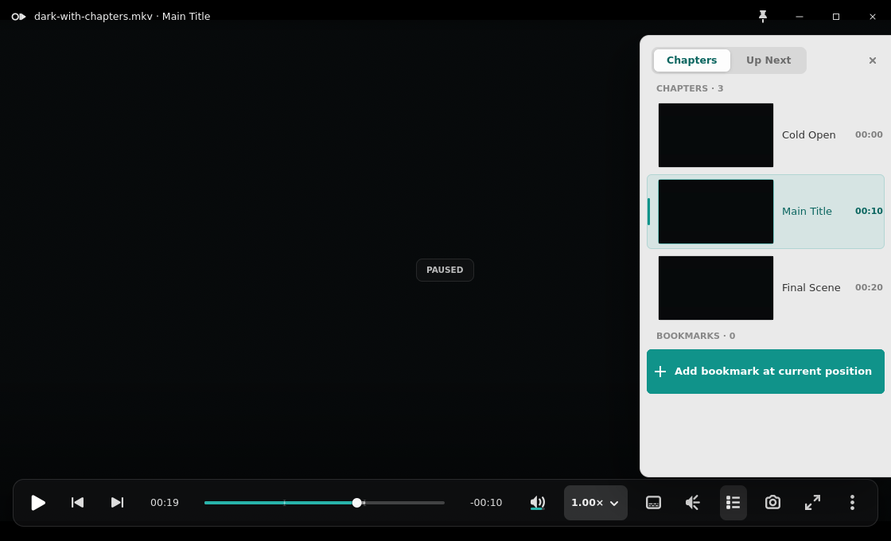

# Linux playback-state acceptance repair

Issue #272 replaces the copied playback-state evidence from the original
delivery with separately induced real mpv states. The implementation captures
are from the same debug binary at the canonical `1120x680` player viewport;
`fullscreen.png` is the real X11 fullscreen transition at `1280x900`.

## Reference and redline

The applicable canonical source is the Main Player interaction handoff, with
the PRD playback, OSD, mouse, and window contracts. The matching public Windows
chapters reference is captured at `1120x680` in
`reference-chapters-1120x680.png`; compare it with `chapters-loaded.png`.

| Area | Canonical accounting | GTK evidence |
|---|---|---|
| Geometry | `1120x680`; floating OSC at the lower inset; chapters panel `316px` wide with `24px` right inset | Exact viewport checks pass; panel occupies `x=780..1095` and leaves the required clear strip |
| Spacing | Main Player control rhythm, 16px inter-group spacing; compact native fallback uses 7x14px OSC padding | Existing merged Volume and compact-popover geometry is unchanged; their dedicated smokes pass |
| Type | Segoe UI Variable hierarchy; tabular timecodes; restrained 13-14px chrome labels | Title/chapter context, time readouts, OSD, and panel rows retain the merged GTK font contract |
| Color/material | `rgba(22,22,25,.50)` OSC, over-video teal `#28B3AA`, light buffered band, localized bottom scrim | Bright and dark real-frame captures keep glyphs legible; the trough, buffered fill, played fill, thumb, and marks are painted from one shared 4px rail geometry |
| Iconography | Existing player glyph order plus titlebar pin; outline at rest, selected accent when active | Control order is unchanged; `always-on-top.png` shows the selected pin after `_NET_WM_STATE_ABOVE` is observed |
| States | Paused cue, delayed loading, in-canvas failure, OSD, buffered band, chapter title context, idle-clear, fullscreen-clear | Every state below is separately induced and has a unique SHA-256 hash |
| Behavior | 2500ms playing idle hide; paused/panel pins chrome; single click pauses; double click enters fullscreen; time label toggles | Playback interaction, fullscreen, Volume, popover, Media Information, playback chrome, and seek-preview smokes pass |

The canonical prototype uses a 16-18px OSC radius and compositor blur. The
merged GTK compact fallback remains 14px radius with deterministic tint,
hairline, shadow, and scrim; this repair does not overwrite that established
native-platform contract.

## Real state induction

| Evidence | Induction |
|---|---|
| `loaded-paused-osc.png` | Load the generated moving bright H.264 source, present real frames, then pause |
| `paused.png` | Separately load the generated dark source without chapters, then pause |
| `buffered-timeline.png` | Play the generated 60-second source through a throttled localhost HTTP range server, then pause after mpv reports `FileLoaded` |
| `buffered-timeline-wide.png` | Resize that same real buffered X11 session to `1240x760` and repeat the pixel-center measurement; this is deterministic Xvfb width coverage, not live Wayland acceptance |
| `chapter-context.png` | Load the chaptered source, seek into `Main Title`, wait for the OSD to clear, and capture the observed title context |
| `osd.png` | Issue a fresh real seek from the chapter-context state |
| `chapters-loaded.png` | Open the real Chapters action; the current `Main Title` row is selected |
| `playing-idle.png` | Resume the chaptered source and wait beyond the canonical idle timeout |
| `buffering-loading.png` | Open a localhost media response whose headers are delayed for 20 seconds |
| `playback-error.png` | Open a real localhost HTTP 404; Retry issues another request and the app remains alive |
| `bright-video-background.png` | Play the generated real bright source with active chrome |
| `dark-video-background.png` | Separately play the generated real dark source with active chrome |
| `fullscreen.png` | Enter X11 fullscreen while playing and wait for titlebar/OSC idle clear |
| `always-on-top.png` | Activate the titlebar pin and assert `_NET_WM_STATE_ABOVE` through `xprop` |

`state-hashes.txt` contains the unique playback-state hashes.
`image-deltas.txt` records the meaningful crop/full-image RMSE checks. The real
buffered run serves more than 64 KB before capture; the buffered rail crop must
differ meaningfully from the paused baseline. `timeline-alignment.txt` records
the crop-measured vertical centers for the played, buffered, and trough layers
at both `1120x680` and `1240x760`; their permitted spread is `0.1px`.

## Acceptance boundary

Xvfb proves deterministic X11 pixels, real mpv lifecycle, X11 fullscreen, and
the EWMH above-state only. It does not prove live GNOME/Wayland compositor
behavior, portal/chooser flows, drag and drop, clipboard integration, or focus
quality. The release contract therefore keeps
`wayland-always-on-top-unavailable` and compositor fullscreen as operator-only
rows. On an unsupported compositor, the expected UI result is the explicit
"Always on top is unavailable on this desktop" toast.

