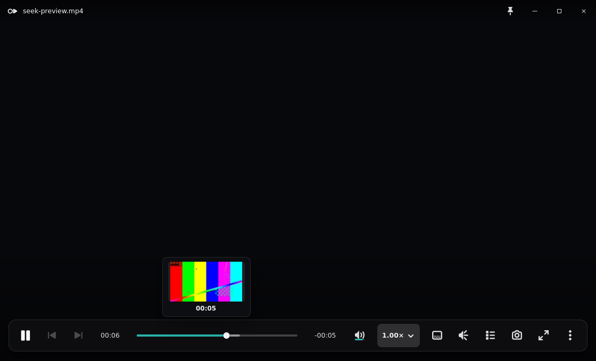

# Issue 274 seek-hover acceptance

## Deterministic implementation capture

The capture is the native Linux player at its default `1120 × 680` viewport. It
loads a deterministic local video, moves the pointer onto the production seek
scale, waits four seconds, and then captures the window. That wait is longer
than the `2500 ms` OSC auto-hide deadline, so the image accounts for all of the
following in one state:

- pointer motion reached the seek scale;
- the hover kept the OSC visible;
- ffmpeg generated a fresh `144 × 80/81` cached frame;
- the completed background job updated the stationary card;
- the card composed above the video plane as an in-window overlay.

The smoke uses a deterministic dark playback substrate because Xvfb does not
reliably present libmpv's GL frame on every runner. Real media remains loaded
and drives the production duration, hover, worker, cache, and visibility paths.

## Reference accounting

The issue names no separate canonical hover mockup. The applicable reference is
the current Windows player contract in `PlayerView.xaml` and
`PlayerView.xaml.cs`, together with the existing Linux seek-preview styling.
This change does not redesign the card; it changes its composition and delivery
path.

| Area | Reference / retained accounting |
| --- | --- |
| Geometry | Windows uses a fixed 158 px preview card with an 89 px image band and an 80 px bottom offset. Linux retains its existing 144 × 81 requested image, 8 × 10 px card padding, 9 px radius, and cursor-centered placement, clamped 8 px inside the player. |
| Spacing | Existing 6 px image-to-time gap and 2 px time-to-chapter gap are unchanged. The card remains 8 px above the seek scale. |
| Type | Existing 12 px bold tabular timecode and 11 px chapter label are unchanged. |
| Color / material | Existing `rgba(14, 15, 18, 0.94)` surface, 10% white border, and soft shadow are unchanged. |
| Iconography | The hover card contains no iconography; no icon assets or mappings change. |
| States | Local files show time first and add the generated frame in place. Streams retain the time/chapter-only fallback. Leaving the timeline hides the card. |
| Behavior | Hover pins the OSC, worker completion updates the active request only, and rapid scrubbing serializes expensive extraction while discarding superseded queued requests. No blocking mpv read or ffmpeg work runs on the GTK main context. |

## Required live GNOME/Wayland acceptance

Xvfb cannot prove compositor behavior on a real Wayland desktop. Before this
draft is made ready, operator QA must use a fresh hover cache with the 4K 10-bit
HEVC sample and confirm:

1. Hover a single seek position without moving again; the time card appears,
   then gains its thumbnail when extraction completes.
2. Keep the pointer stationary for more than 2.5 seconds; the OSC and card stay
   visible.
3. Scrub across several ten-second buckets; playback remains responsive and
   only the latest queued frame is decoded after the active decode.
4. Capture the full player at the live window geometry with the thumbnail card
   above the seek bar.
