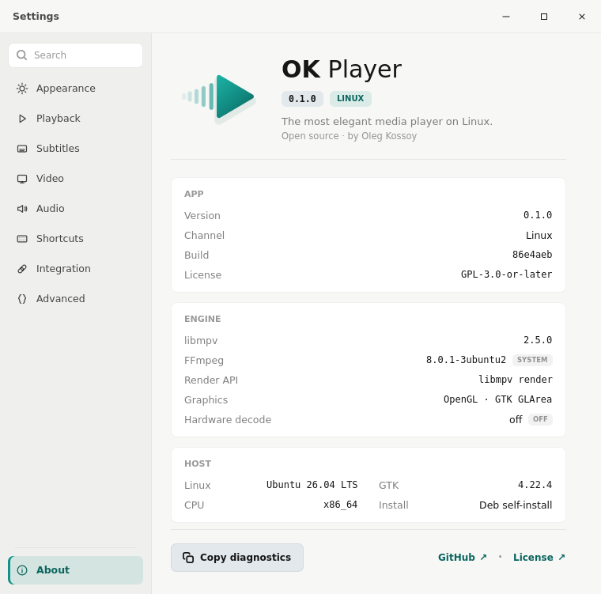
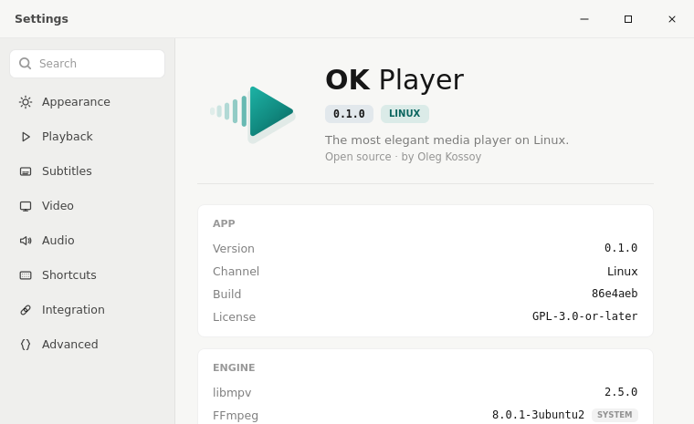
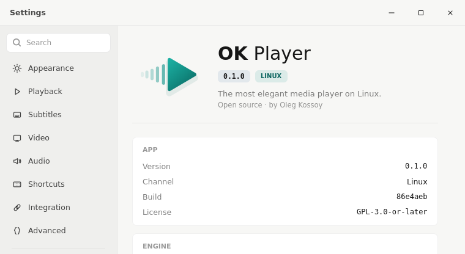
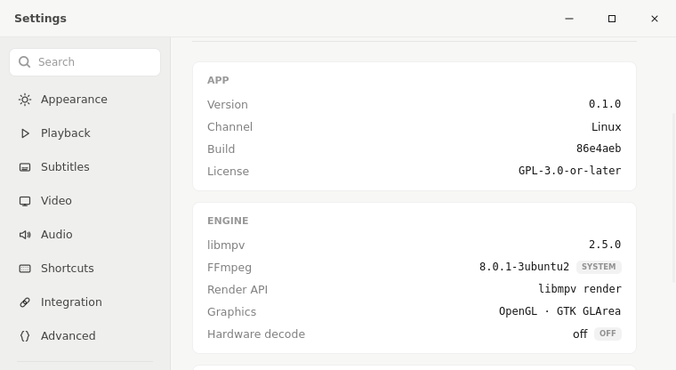
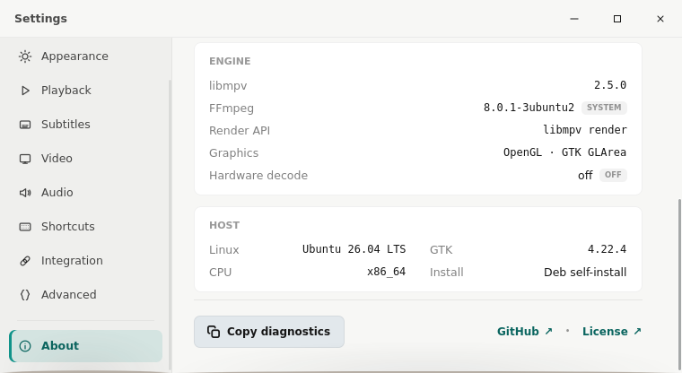

# Linux Settings bounded natural-height acceptance

Issue #283 replaces the fixed `760x560` Settings shell with a fixed-width,
page-natural-height window bounded by the active monitor. These captures come
from `scripts/smoke-linux-settings.sh` against the same GTK debug binary under
the repository's deterministic Xvfb/Xfwm harness.

## Deterministic geometry

| State | Workarea height | Window | Result |
|---|---:|---:|---|
| About | 900px | `760x751` | Tall content fits naturally with no excess empty body |
| Appearance | 900px | `760x465` | Switching pages shrinks the existing window to the short page |
| About restored | 900px | `760x751` | Switching back recomputes and restores the tall natural height |
| About constrained | 480px | `760x416` | Window stops at workarea minus the shared 64px safety margin |

The constrained run separately scrolls the content and the navigation rail.
It hashes the 42px title strip before and after content scrolling and requires
an exact match. It also requires changed content and rail crop hashes, proving
that the body regions scroll rather than silently clip. The final rail capture
shows the initially clipped About row reachable at the bottom.

The exact measurements are recorded in `geometry.txt`. Pure Rust projection
tests cover short content, fitting tall content, overflowing content, a small
workarea where both regions scroll, and degenerate monitor data.

## Acceptance boundary

This is deterministic X11 render evidence. It proves sizing arithmetic,
page-switch reprojection, fixed title chrome, and independently reachable
overflowing content/rail. Live GNOME/Wayland monitor, scale, compositor, and
focus quality remain operator-observed behavior; these captures do not claim
to replace that boundary.

