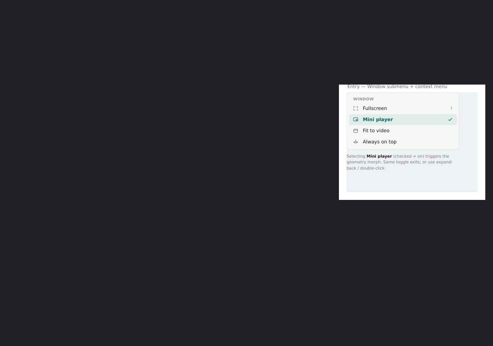
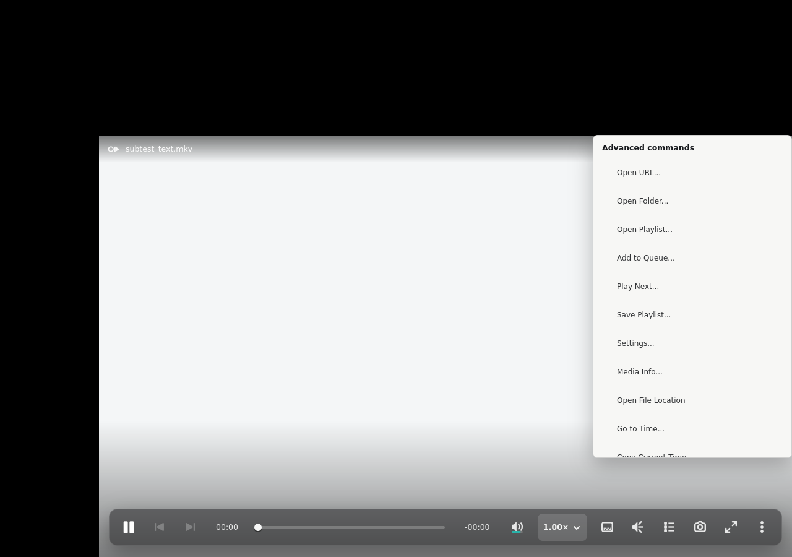
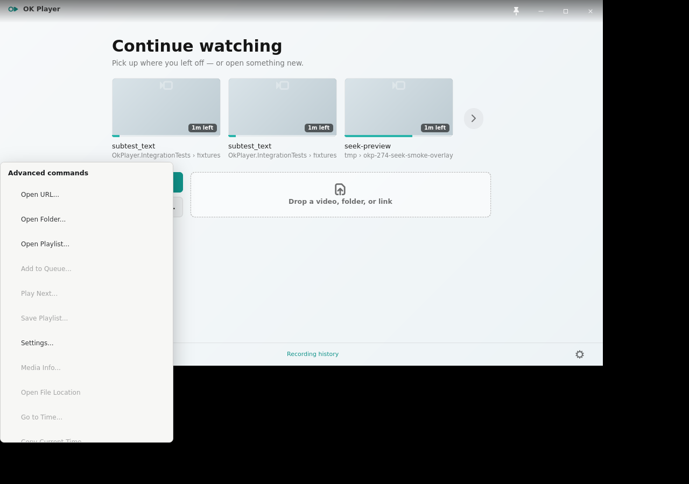
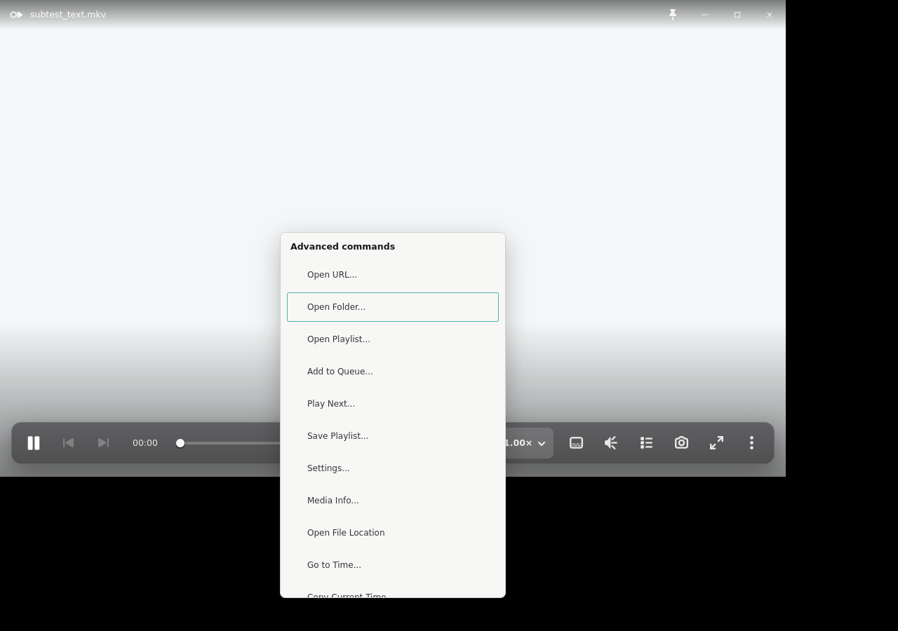

# Issue 290 — player-wide context-menu acceptance

Issue #290 changes only secondary-click routing. It reuses the existing
`Advanced commands` popover, its actions, native focus behavior, CSS, and
scrolling; no player or menu composition was redesigned.

## Reference and implementation captures

Both comparison canvases are `1280x900`, and both show the context-menu state.
`reference-context-menu-1280x900.png` places the canonical compact-modes
context-menu component extract on a neutral canvas rather than inventing a
player composite that the design source does not provide. The applicable
standard-player composition and command hierarchy remain the current Windows
`PlayerView.xaml` context flyout and PRD sections 14.0, 14.9, and 15.1.

- `gtk-workarea-edge-context-1280x900.png` — the `1120x680` GTK player is moved
  to the lower-right edge of the `1280x900` X11 workarea, then right-clicked
  near its lower-right canvas edge. GTK flips and clamps the `320px`-wide,
  `520px`-maximum scrollable menu inside the visible workarea.
- `gtk-empty-canvas-context-1280x900.png` — the same canonical menu opened from
  the non-interactive welcome canvas with no media loaded.
- `gtk-keyboard-focus-context-1280x900.png` — the menu after native Tab focus;
  Escape closes it through the standard popover behavior.

## Redline accounting

| Area | Canonical accounting | GTK result |
|---|---|---|
| Geometry | Context menu at the pointer; native placement must remain visible at workarea edges | Root-relative click coordinates feed the popover pointing rectangle. The lower-right probe stays within `1280x900`; the established `320px` width and `520px` scroll cap are unchanged. |
| Spacing | Existing compact/native menu row rhythm and grouped hierarchy | No CSS or menu-content changes. Existing 2px content rhythm, native row padding, dividers, and group labels are reused. |
| Type | Existing menu hierarchy with a semibold section title and ordinary command labels | `Advanced commands` and every existing action retain the current GTK type treatment. |
| Color/material | Light elevated context surface over the player; no new player chrome | Existing `okp-track-popover` material, border, radius, and elevation are unchanged. The bright playback substrate is intentionally severe so the menu boundary remains measurable. |
| Iconography | Existing canonical action set; no new glyph family | No icons or command labels change. The implementation routes to the same `advanced_command_popover_content` builder. |
| Control states | Controls and popovers keep their own interaction; disabled commands remain visibly disabled; menu stays keyboard traversable | Runtime hit-testing includes insensitive widgets, blocks buttons/scales/list rows/popovers/resize handles, and lets native child gestures run before the root bubble controller. Tab focus and Escape pass in the smoke. |
| Behavior | Right-click works on video, empty canvas, title/background, and chrome gaps without duplicates; left drag and double-click fullscreen remain intact | Each accepted probe emits exactly one open event. Play-control and More-popover probes emit none. The existing playback-interaction smoke still passes delayed single-click, double-click fullscreen, and control isolation. |

## Evidence boundary

Xvfb/XFWM proves deterministic X11 event routing, native popover placement,
keyboard traversal, and the tested `1280x900` workarea edge. It does not prove
live GNOME/Wayland compositor placement, fractional scaling, multi-monitor
workareas, portal behavior, clipboard integration, or desktop focus quality;
those remain operator QA boundaries.

