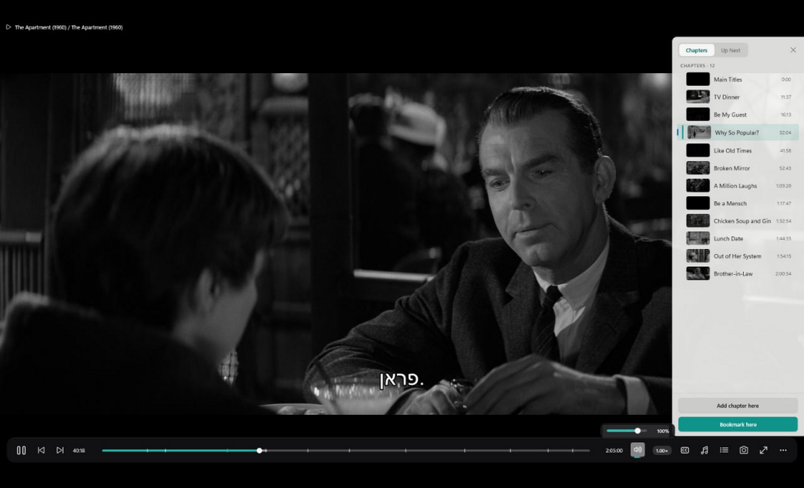
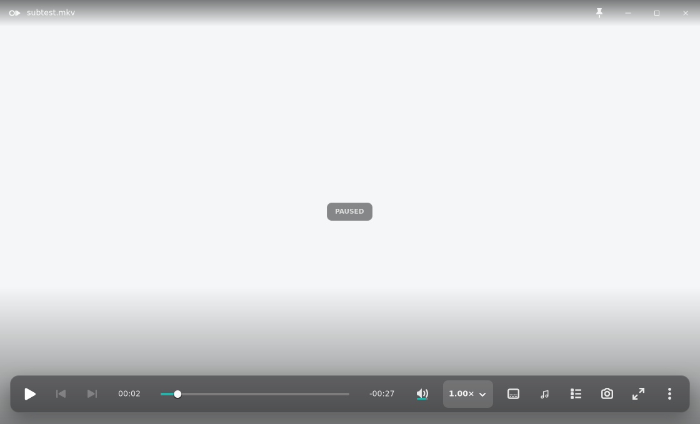
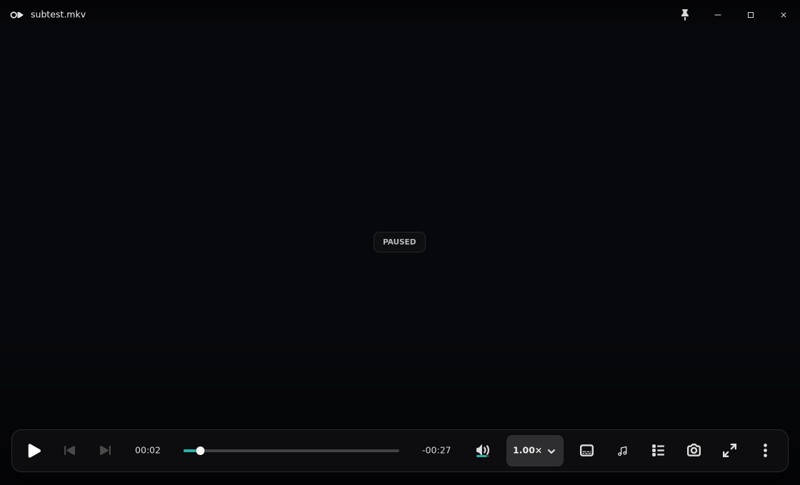
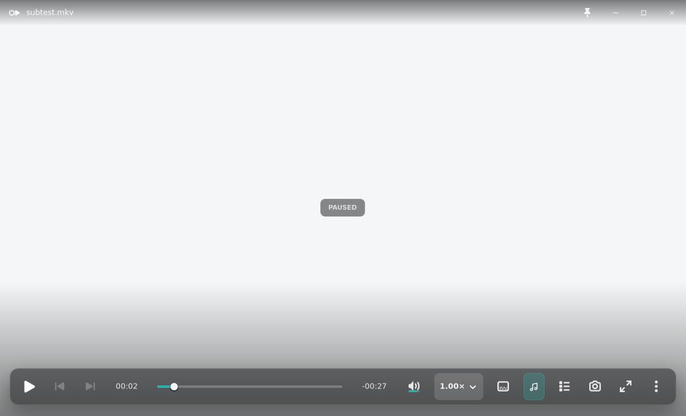
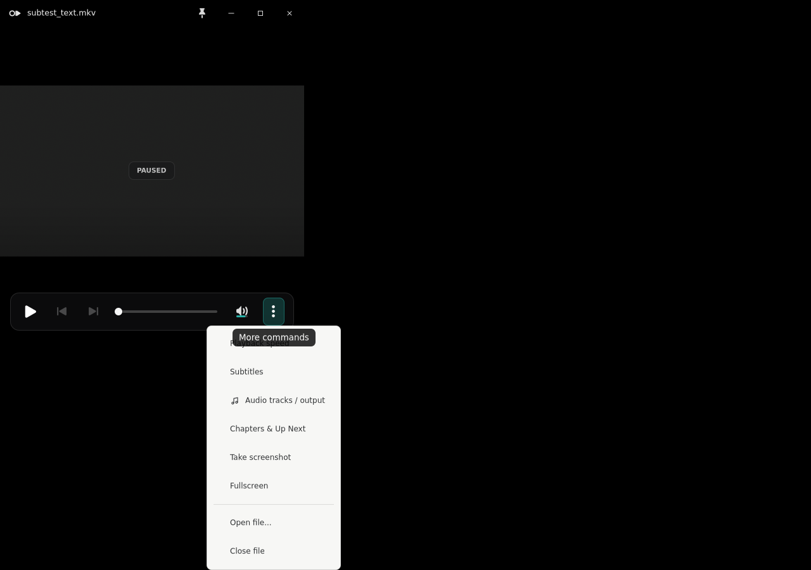

# Issue 327 audio-track OSC regression evidence

These captures come from the binary extracted from the Debian package built for
this change. The focused smoke loads real media, maps the production GTK window,
and measures the rendered controls rather than checking icon-name strings.

## Reference and implementation

| Canonical Windows OSC | Packaged Linux OSC |
| --- | --- |
|  |  |

The canonical Windows reference gives Volume the speaker/level identity and the
audio-track action a double music note. Linux now renders that same semantic
split without depending on an optional host icon-theme resource.

## Captured states

### Dark video

### Audio chooser open

### Adaptive collapse

At the 480 px adaptive floor the audio action moves into the existing overflow
policy. Its row retains the music-note identity and the explicit
`Audio tracks / output` label instead of becoming an empty or ambiguous action.

## Redline accounting

| Area | Accounting |
| --- | --- |
| Geometry | The standard OSC target remains 32 × 32 px inside the existing 34 px slot. The note is optically fixed at 19 px; the overflow-row note is 16 px. No button, bar, or popover width changes. |
| Spacing | Canonical order and the 16 px OSC gap remain unchanged: Volume · speed · subtitles · audio · chapters. The adaptive policy is unchanged. |
| Type | No OSC typography changes. The adaptive row uses the existing track-row label style and the full `Audio tracks / output` text. |
| Color / material | The Cairo glyph reads the widget foreground color, so existing normal, hover, checked, focus, disabled, dark-video, and HighContrast state colors continue to own contrast. The OSC material and scrim are unchanged. |
| Iconography | Volume keeps its reactive speaker/mute/level glyph and teal/amber wick. Audio uses the canonical double music note, rendered in-process so a sparse packaged icon theme cannot erase it. |
| Control states | Mapped pixel assertions cover normal, hover, chooser-open/selected, 900 px narrow, adaptive overflow, bright video, dark video, and HighContrast. Existing volume mute and boost behavior is untouched. |
| Behavior | The same `GtkMenuButton`, popover wiring, accessibility label, tooltip, focus return, track selection, and output selection paths remain in place. The smoke clicks the mapped action and requires the audio chooser to open. |

## Measured package evidence

The focused smoke recorded:

- audio/volume normalized image RMSE: `0.334377` (distinct identities);
- rendered audio-glyph bright-pixel fraction: `0.130194` normal,
  `0.149584` hover, `0.144044` chooser-open, `0.119114` at 900 px;
- rendered audio-glyph bright-pixel fraction: `0.108033` on dark video and
  `0.108033` with HighContrast;
- adaptive overflow note dark-pixel fraction: `0.0282258`;
- audio chooser open: pass.

## QA limits

Xvfb proves deterministic mapped GTK allocation and rendering, including the
separate native popover surface. It does not prove a live GNOME/Wayland
compositor, physical keyboard focus-ring appearance, or an AT-SPI screen reader
announcement. The accessible label and tooltip are unit-guarded as
`Audio tracks / output`; live assistive-technology confirmation remains operator
QA rather than a claim from these captures.
