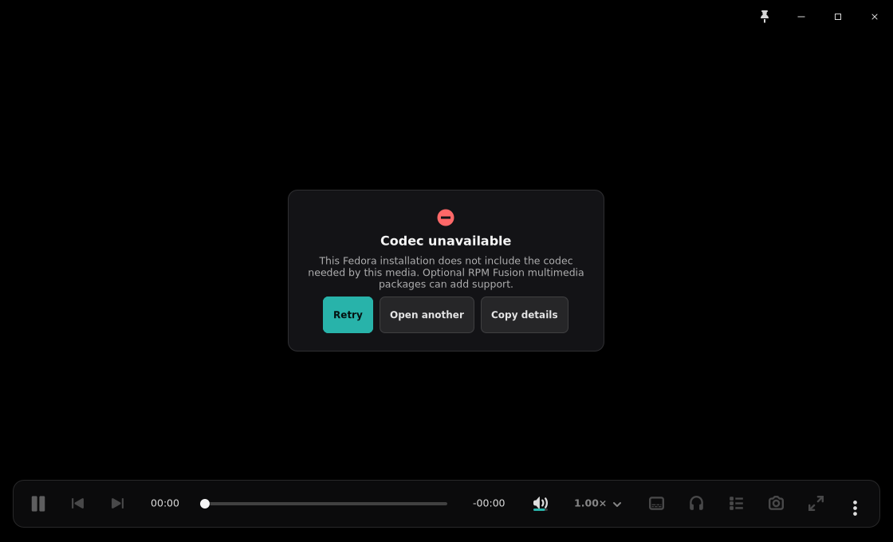

# Fedora codec diagnostic accounting

The implementation capture is the Fedora missing-codec state at the canonical
`1120x680` player viewport. The matching pre-change error-state reference is
[`../issue-272/playback-error.png`](../issue-272/playback-error.png), captured at
the same viewport from the established GTK playback-state surface. The
canonical PRD and Compact Modes handoff require a centered non-modal error card
with a human message and Retry / Open another / Copy details actions.

| Area | Reference contract | Fedora codec state |
|---|---|---|
| Geometry | Centered card over the playback canvas; player remains `1120x680` | Reference card is about `390x190` at `(365,245)`; Fedora copy produces about `398x204` at `(361,238)`, remaining centered while adding 8px width and 14px height for the extra body line; viewport and controls are unchanged |
| Spacing | Icon, title, short body, then one horizontal action row | Existing 8px card rhythm, 22x24px padding, and 8px action gaps are unchanged |
| Type | Strong human title, restrained explanatory copy, raw engine detail hidden | `Codec unavailable` is the title; Fedora/RPM Fusion context is body copy; libmpv logs stay behind Copy details |
| Color/material | Dark localized card, danger icon, teal primary action, quiet secondary actions | Existing GTK material, border, shadow, icon, and control-state tokens are unchanged |
| Iconography | Error mark plus the established recovery actions | Existing symbolic error icon and action order are unchanged |
| Behavior | Non-modal; retryable; user can choose another source; details are explicit | Retry keeps the source, Open another stays available, Copy details includes libmpv payload and optional remediation |

The screenshot is deterministic X11/Xvfb evidence. It proves the rendered
copy, geometry, and control states only; it does not prove live GNOME/KDE
portals, compositor focus, stock-codec playback, or an RPM Fusion transition.
Those remain separate Fedora acceptance-harness/operator evidence.

