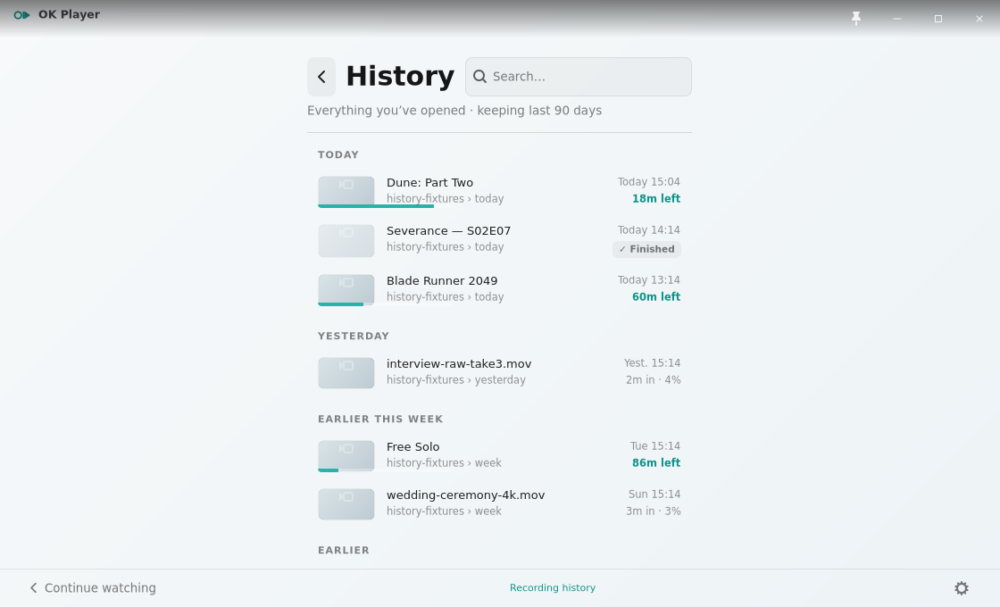
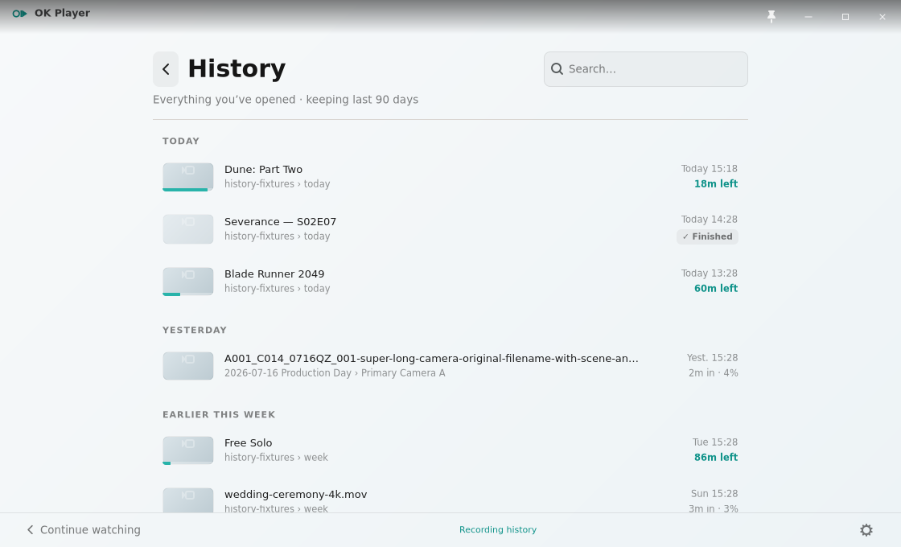
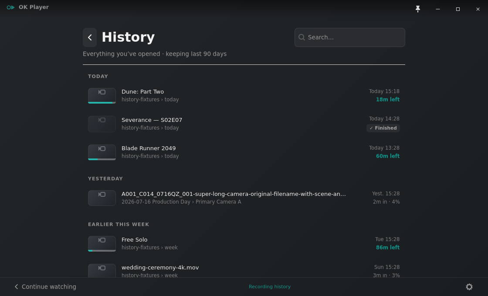
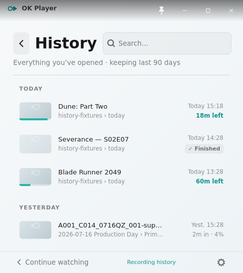
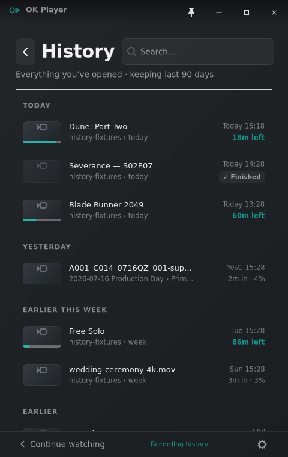
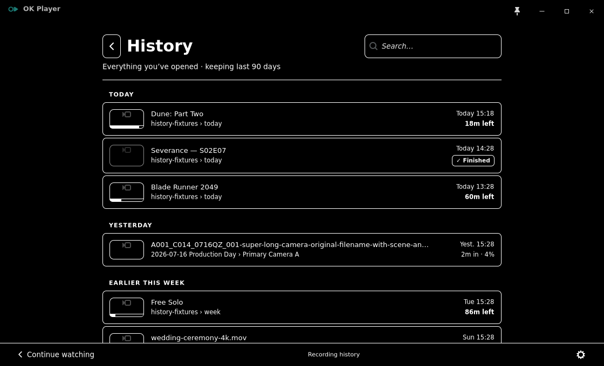

# Issue 376 — Linux History row hierarchy

Reference contract: issue #376, PRD sections 12.3, 16.3, 16.5, and 16.7,
the canonical `OK-Player-History.dc.html` History surface, and the current
Windows `HistoryView.xaml` anatomy. The canonical sources keep the 64×36
thumbnail, primary title, secondary source, right-aligned watched/state block,
and dated groups. Issue #376 explicitly supersedes their compact row density
for the Linux surface while preserving that anatomy.

## Captures

All desktop captures are full `1120×680` windows in the same populated History
state. The narrow captures are full `480px`-wide windows, not component crops.

- `before-history-light-1120x680.png` — pre-change GTK baseline. The page keeps
  its roughly 430px compact natural width on a desktop viewport, forcing the
  title/path and watched/state columns into the same narrow space.
- `gtk-history-light-1120x680.png` — corrected light History with the long
  camera item visible as the fourth row.
- `gtk-history-dark-1120x680.png` — the same viewport and state in dark theme.
- `gtk-history-light-480x540.png` — minimum supported-width hierarchy with four
  complete rows, including the ellipsized long camera title and path.
- `gtk-history-dark-480x760.png` — taller narrow evidence showing later groups
  remain readable and scroll naturally.
- `gtk-history-high-contrast-1120x680.png` — solid substrate, explicit row
  boundaries, white progress treatment, and high-contrast text/control states.

## Redline accounting

| Area | Reference/accounting | GTK result |
|---|---|---|
| Geometry | Canonical History wrapper is 792px with 26px horizontal padding and a 740px inner span; thumbnails are 64×36 at 16:9 | The responsive wrapper measures 792px on desktop and shrinks to the viewport. The smoke measures the desktop divider at x=190..929 in the 1120px window. |
| Row rhythm | Canonical anatomy uses compact 9px padding; issue #376 requires deliberate padding/minimum height and clearer separation | Linux rows use 12px vertical padding, a 60px minimum, and a 4px inter-row gap from the established 8px/4px grid. The measured first-to-third progress-row distance is 130px, or two 65px rasterized pitches. |
| Hierarchy | 13px medium title over 11.5px tertiary source; watched time above state/remaining metadata | The title/source stack expands in the center. A reserved 104px right block aligns both metadata lines and prevents them from competing with the primary column. |
| Long values | One-line end ellipsis; full values remain available through the existing tooltip/accessibility pattern | The long camera title and nested source path ellipsize before the metadata block at 480px. Title and source labels expose their full values, while the row retains the full-path tooltip. |
| Progress | Teal thumbnail-bottom progress for in-progress items; no row-wide data-table bar | GTK's progress widget minimum is explicitly removed. The smoke measures a 56px fill for the 86% fixture, contained inside the 64px thumbnail instead of extending into the title column. |
| Groups | TODAY, YESTERDAY, EARLIER THIS WEEK, and EARLIER keep a restrained dated-list rhythm | Headers retain the canonical 11px semibold uppercase treatment, with a 20px top interval and 8px separation before rows. |
| Color/material | Light and dark themed idle substrates; accent limited to progress/state; contrast settings respected | Existing light/dark materials are unchanged. High contrast switches to a solid black substrate, white boundaries/type/progress, and inverted hover/focus states. |
| Iconography | Existing symbolic back, search, thumbnail placeholder, and footer icons | No icon family or control composition changes. |
| Control states | Whole row remains the activation/focus target; progress semantics and footer behavior remain intact | Rows remain native GTK buttons with the existing click handler and focus-visible treatment. `GtkProgressBar` remains the semantic progress control inside the thumbnail. |

## Deterministic checks

`scripts/smoke-linux-empty-states.sh` now fails when:

- the desktop History wrapper collapses back to compact width;
- row pitch loses the deliberate spacing;
- progress escapes the 64px thumbnail;
- the fourth long-path item disappears from the standard viewport;
- narrow metadata disappears or content reaches the right-edge clip probe; or
- high-contrast History loses its solid substrate or explicit boundaries.

The Rust unit test also locks the 792px desktop clamp, 480px shrink behavior,
60px row minimum, and 104px metadata width.

## Evidence boundary

Xvfb/XFWM proves deterministic GTK allocation, ellipsis, scrolling, light/dark
and high-contrast CSS selection, and the measured X11 raster geometry. It does
not prove live GNOME/Wayland font rasterization, compositor scaling, tooltip
timing, assistive-technology announcements, or subjective keyboard focus
quality; those remain operator QA boundaries.

