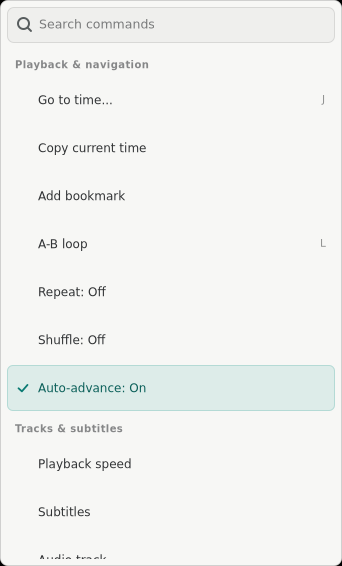
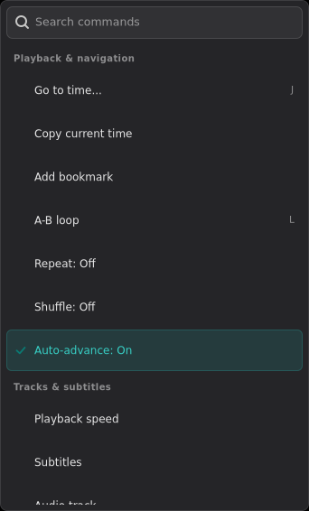
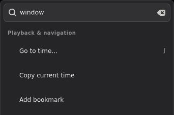
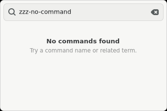
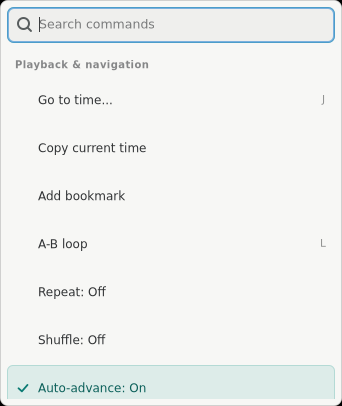
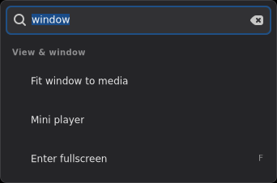
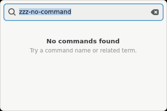
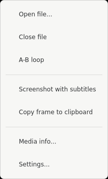
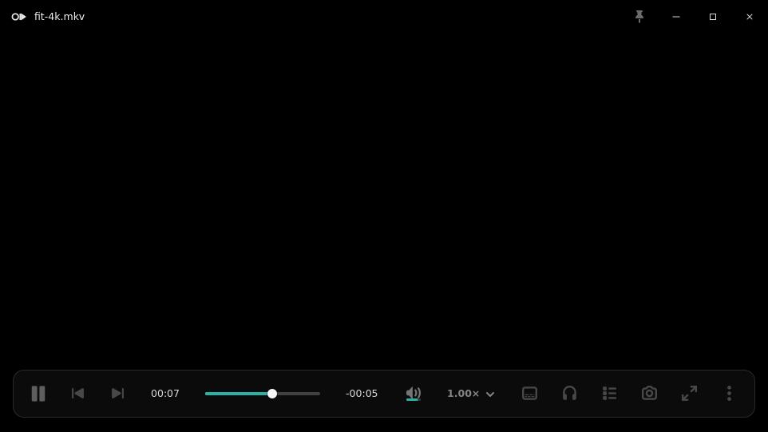
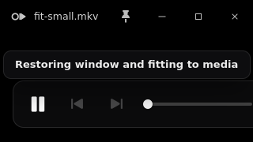

# Issue 377: unified searchable player commands

These mapped X11/Xvfb captures account for the shared `More commands` and
right-click presentations introduced by issue 377. The functional reference is
PRD §§2.3 and 2.12. Visual decisions follow the canonical compact-popover
material and row anatomy from issue 264, the app search treatment from the
History design, and the current Windows player command hierarchy.

## Redline accounting

| Property | Reference / contract | Implementation evidence |
|---|---|---|
| Geometry | The prior compact More surface is 212 px including borders; issue 377 requires the complete registry plus search without monitor overflow. | Both command surfaces request 340 px content / render at 342 px with borders. More is capped at 566 px in the 1280×900 work area; cursor-anchored context menus cap at 406 px and flip below the pointer. The popup outer bounds remain inside the 1280×900 work area. |
| Narrow state | Commands must remain usable when the player collapses to its compact OSC. | `more-narrow-480x270.png` shows the same 342 px surface anchored to the More button in a 480×270 player; the popup stays inside the monitor rather than expanding the player. |
| Spacing | Compact native rows, restrained grouping, no redundant separators. | 6 px shell padding; 34 px command rows; 8 px row inset; 10/4 px group header spacing; 6 px row radius; 7 px search radius. Group headers preserve context after filtering. |
| Type | App search and command hierarchy must remain quieter than player chrome. | Search 12.5 px; command labels 12 px; shortcut labels 10.5 px with tabular figures; group labels 10 px semibold. |
| Color / material | Light and Dark are first-class; selected state uses the app accent. | Light uses `#f7f7f5`; Dark uses `#252528`. Both retain a one-pixel hairline and elevation. Selected rows use the live light-surface accent or the over-video dark accent. |
| Iconography | Search, clear, and checked states must be unambiguous without adding a new menu icon family. | GTK SearchEntry supplies the standard search/clear affordance; the existing app-owned Cairo check geometry marks checked commands. No decorative per-command glyphs were invented. |
| States | Enabled, disabled, checked, filtered, and no-results states must be deliberate. | Media-dependent commands remain visible but disabled until their state is known. Filtered captures retain `View & window`; no-results uses a titled empty state and recovery hint. |
| Behavior | Immediate label/keyword search; keyboard entry/navigation/activation; Escape clear then close; one action path for both surfaces. | Search receives focus on open, Down enters the first enabled row, arrows traverse enabled rows, Enter activates the first enabled match, and Escape clears before dismissing. Core parity and dispatch tests cover IDs/order/groups/state and Fit Window routing. |

## Command surfaces and search states

The prior compact surface is retained here as the material/row reference. Its
212 px width is intentionally superseded by issue 377's searchable full-registry
requirement; radius, hairline, elevation, row density, and restrained accent
remain the inherited art direction.

## Fit window evidence

The explicit command uses the existing monitor-aware clamped transaction. The
4K fixture was manually resized away from its media geometry, then restored to
962×541 inside a 1024×768 active monitor without reopening media or changing
playback. The maximized 320×180 fixture likewise exited maximized state only
after the explicit command and returned to its natural media size.

## Verification and limits

The deterministic runs recorded:

- both mapped surfaces in light/dark, filtered, no-results, and narrow states;
- exact 342 px bordered width for both presentations;
- context popup outer bounds within the 1280×900 work area;
- explicit Fit Window from ordinary, maximized, fullscreen, and manually
  resized 4K states;
- mouse/keyboard menu activation, double-click fullscreen, OSC target
  isolation, existing-popover isolation, seek/panel isolation, and repeated
  fullscreen toggles.

See `context-interaction-results.txt` and `playback-interaction-results.txt` for
the recorded pass matrix.

Xvfb proves deterministic rendering and X11 event routing only. It does not
prove live GNOME/Wayland compositor placement, title drag, portal/file chooser,
clipboard, drag/drop, or focus behavior. The headless title-drag probe is
therefore recorded as `skipped`; those behaviors remain operator QA rather than
claims made by this evidence.
