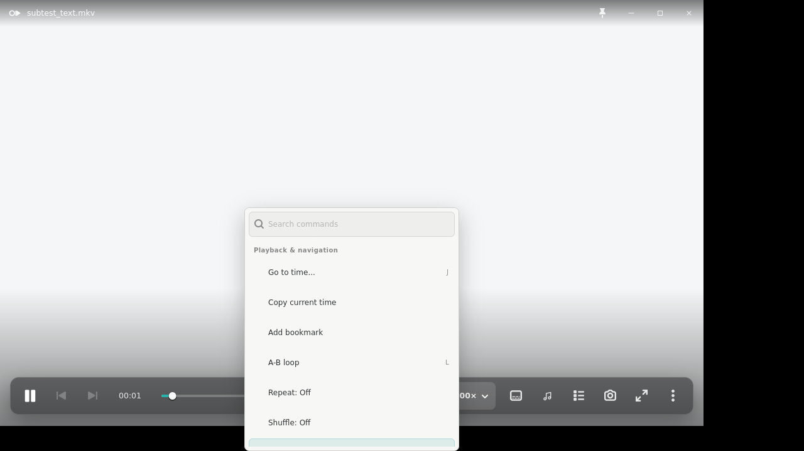
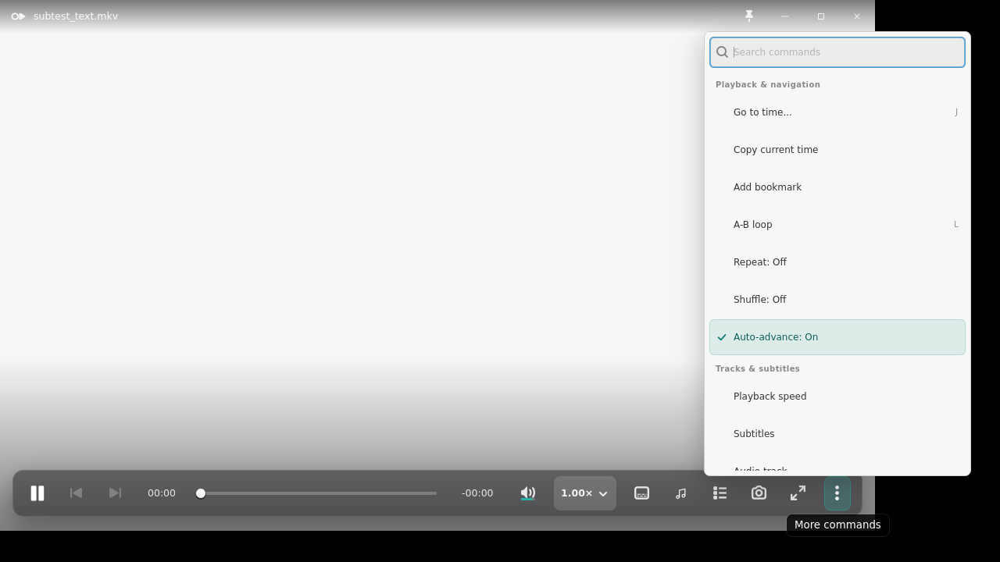
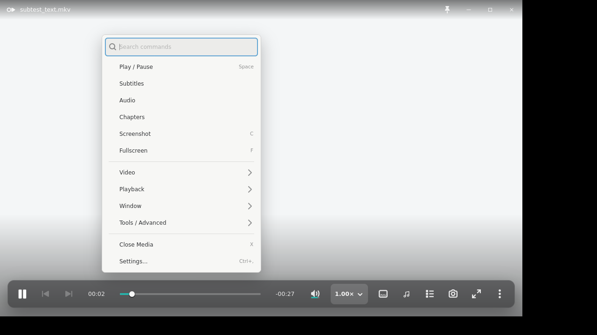
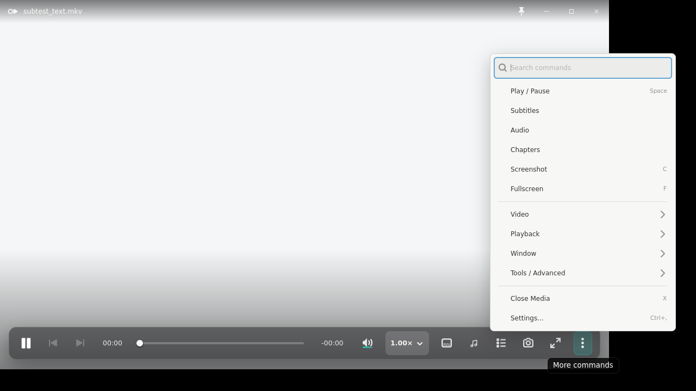

# Issue 465: curated player command menus

The before and after captures use the same `1280x720` Xvfb workarea, the same
`1120x680` player geometry, the same bright playback fixture, and the same
unfiltered first-open state. The before images were rendered from source
baseline `5b33b14330b9de8f301789e5aa98fc3131f92d80`; the after images were
rendered from the candidate working tree before publication.

## Before / after

The baseline exposes the 46-command registry as one scrolling wall. The
right-click surface shows only the first playback rows before its scrollbar,
and the overflow reaches only partway into Tracks & subtitles.

The candidate presents the same concise first level in both entry points:
Play / Pause, Subtitles, Audio, Chapters, Screenshot, Fullscreen, Video,
Playback, Window, Tools / Advanced, Close Media, and Settings. The four rows
with chevrons open second-level pages; search still filters the complete
registry.

## Redline accounting

| Area | Contract | Candidate result |
|---|---|---|
| Geometry | Core actions visible without scrolling at `1280x720`; transient surface remains inside the workarea | Both surfaces retain the established 342px bordered width and render at 511px outer height. The content adjustment reports `452/452`, so no vertical scrollbar is required. Context menus anchor left/right of the pointer, allowing the surface to center vertically and remain inside the workarea. |
| Spacing | Compact native rows; hierarchy must replace the flat wall | Command rows use a 26px content minimum with 3px vertical inset, 2px rhythm, and two quiet separators. Six core rows, four submenu rows, and the bottom Close/Settings pair remain visible together. |
| Type | Preserve the existing quiet command/search hierarchy | Existing 12px command labels, 10.5px shortcut labels, and compact search typography are unchanged. First-level labels use the concise PRD vocabulary; resolved state labels remain available in search and second-level pages. |
| Color / material | Reuse canonical compact-popover material in Light and Dark | Existing light/dark surface, hairline, radius, shadow, hover, selected, disabled, and focus treatments are retained. No new material or accent color was introduced. |
| Iconography | Do not invent a decorative command-icon family | Standard symbolic chevrons communicate the four second-level pages. Existing check and search icons remain; ordinary commands stay text-led. |
| Control states | Enabled, disabled, checked, keyboard, and no-results states remain deliberate | The same resolved registry supplies state and shortcuts. Search still exposes all 47 commands, including checked/disabled rows; Escape clears search, returns from a page, then dismisses. |
| Behavior | Shared two-level hierarchy for context and overflow; long tail remains searchable; Close is immediately findable | `okp-core` owns one first-level sequence and four exhaustive page assignments. GTK uses that model for both entry points and dispatches through the existing shared action path. Close Media is bottom-anchored at first level in both captures. |

## Verification boundary

The Xvfb/XFWM smoke proves deterministic X11 rendering, first-level fit,
top-level Close Media presence, native popup placement, shared context/overflow
composition, keyboard search, and the existing geometry-command activation
path. It does not prove live GNOME/Wayland compositor placement, fractional
scaling, multi-monitor behavior, portal/file-chooser behavior, clipboard
integration, or desktop focus quality; those remain operator QA boundaries.
